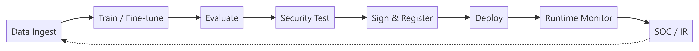

# MLSecOps Practical Reference Guide

[](CHANGELOG.md)
[](CHANGELOG.md)
[](LICENSE)

Open-source **practical reference** for securing AI systems across the ML lifecycle — from data and training through deployment, runtime, SOC, and governance.

**Not** a product user manual, an official industry standard, or affiliated with OpenSSF, OWASP, NIST, or ISO.

| | |
|---|---|
| **Documentation site** | [l4tr0d3ctism.github.io/MLSecOps](https://l4tr0d3ctism.github.io/MLSecOps/) |
| **Read (Markdown)** | [Table of Contents](chapters-en/TABLE-OF-CONTENTS.md) · [Chapter 1](chapters-en/01-intro.md) |
| **Summary (Persian)** | [GUIDE-SUMMARY.md](GUIDE-SUMMARY.md) — full section-by-section overview |
| **Implement** | [Appendix E: Implementation Reference](chapters-en/17-appendix-e-implementation-reference.md) |
| **Quick paths** | [Getting Started](GETTING-STARTED.md) |
| **Releases** | [GitHub Releases](https://github.com/l4tr0d3ctism/MLSecOps/releases) · [Downloads](#downloads) |
| **Contribute** | [CONTRIBUTING.md](CONTRIBUTING.md) · [Issues](https://github.com/l4tr0d3ctism/MLSecOps/issues) · [Discussions](https://github.com/l4tr0d3ctism/MLSecOps/discussions) |

---

## What this guide adds

This guide **synthesizes** OWASP, MITRE ATLAS, NIST AI RMF, ISO/IEC 42001, OpenSSF Secure MLOps, and CSA MAESTRO. Its operational additions are:

1. **Ten lifecycle control points** — one thread from change initiation through monitoring  
2. **Explicit release decisions** — separate evidence-producing steps from blocking gates (control points 4, 7, 8) and integrity at 9  
3. **`Evidence Pack`** — auditable output bundle per release  
4. **[Implementation Reference](chapters-en/17-appendix-e-implementation-reference.md)** — architecture cards, decision matrix, templates, playbooks  

Details: [Chapter 1 — What this guide adds](chapters-en/01-intro.md#what-this-guide-adds-beyond-owasp-openssf-and-nist).

---

## Who it is for

| Role | Start here |
|------|------------|
| Executive / risk owner | [Ch.1](chapters-en/01-intro.md) → [Ch.2](chapters-en/02-scope-risk-threat-model.md) → [Ch.14](chapters-en/14-maturity-roadmap.md) |
| Security engineer | [Ch.2](chapters-en/02-scope-risk-threat-model.md) → [Ch.6](chapters-en/06-pipeline.md) → [Ch.12](chapters-en/12-threat-control-tools-map.md) |
| ML / MLOps | [Ch.6](chapters-en/06-pipeline.md) → [Ch.5](chapters-en/05-model-artifact-supply-chain.md) → [Ch.9](chapters-en/09-anti-patterns.md) |
| LLM / RAG / Agent | [Ch.7](chapters-en/07-llm-rag-security.md) → [Ch.8](chapters-en/08-agentic-ai-security.md) |
| Platform / Kubernetes | [Ch.16](chapters-en/16-kubernetes-deployment-reference.md) → [Ch.10](chapters-en/10-monitoring-soc-ir.md) |
| Production rollout | [Appendix E](chapters-en/17-appendix-e-implementation-reference.md) → [Ch.6](chapters-en/06-pipeline.md) |

Full paths: [GETTING-STARTED.md](GETTING-STARTED.md).

---

## Architecture overview

Executive lifecycle (detail in [Chapter 6](chapters-en/06-pipeline.md)):



**Coverage:** classic ML · LLM · RAG · managed AI APIs · agents · MCP · Shadow AI · supply chain · runtime · SOC · governance · Kubernetes patterns.

---

## Documentation

| Resource | Description |
|----------|-------------|
| [TABLE-OF-CONTENTS.md](chapters-en/TABLE-OF-CONTENTS.md) | Full TOC with section links |
| [GUIDE-SUMMARY.md](GUIDE-SUMMARY.md) | Complete Persian summary of every section |
| [17-appendix-e-implementation-reference.md](chapters-en/17-appendix-e-implementation-reference.md) | Templates, matrices, architecture cards |
| [CHANGELOG.md](CHANGELOG.md) | Version history |
| [GOVERNANCE.md](GOVERNANCE.md) | Project status and versioning policy |

### Chapters

| # | Title |
|---|--------|
| 1 | [Abstract and Introduction](chapters-en/01-intro.md) |
| 2 | [Scope, Audience, and Threat Model](chapters-en/02-scope-risk-threat-model.md) |
| 3 | [Autonomous AI Threats](chapters-en/03-threat-landscape.md) |
| 4 | [Data Security and Privacy](chapters-en/04-data-security-privacy.md) |
| 5 | [Model, Artifact, and Supply Chain](chapters-en/05-model-artifact-supply-chain.md) |
| 6 | [MLSecOps Lifecycle Control Model](chapters-en/06-pipeline.md) |
| 7 | [LLM and RAG Security](chapters-en/07-llm-rag-security.md) |
| 8 | [Agentic AI Security](chapters-en/08-agentic-ai-security.md) |
| 9 | [Anti-patterns](chapters-en/09-anti-patterns.md) |
| 10 | [Monitoring, SOC, and IR](chapters-en/10-monitoring-soc-ir.md) |
| 11 | [Governance and Evidence Pack](chapters-en/11-governance-evidence.md) |
| 12 | [Threat, Control, and Tool Mapping](chapters-en/12-threat-control-tools-map.md) |
| 13 | [Case Studies](chapters-en/13-case-studies.md) |
| 14 | [Maturity Roadmap](chapters-en/14-maturity-roadmap.md) |
| 15 | [Conclusion and Appendices](chapters-en/15-conclusion-appendix.md) |
| 16 | [Kubernetes Deployment Reference](chapters-en/16-kubernetes-deployment-reference.md) |
| E | [Implementation Reference](chapters-en/17-appendix-e-implementation-reference.md) |

**Reading on GitHub:** open any `.md` file under `chapters-en/` — diagrams are embedded **PNG images** (`assets/diagrams/`). Mermaid source for edits: `assets/diagrams/source/*.mmd`.

**Documentation site (MkDocs):** [l4tr0d3ctism.github.io/MLSecOps](https://l4tr0d3ctism.github.io/MLSecOps/) — built from `main` via GitHub Actions.

---

## Downloads

| Format | Status | How to get it |
|--------|--------|----------------|
| **Markdown** | Available | This repository (`chapters-en/`) |
| **Documentation site** | Available | [l4tr0d3ctism.github.io/MLSecOps](https://l4tr0d3ctism.github.io/MLSecOps/) |
| **Source (ZIP)** | **v1.0.0** | GitHub auto-generated [Source code (zip)](https://github.com/l4tr0d3ctism/MLSecOps/archive/refs/tags/v1.0.0.zip) on each release |
| **Word (DOCX)** | **v1.0.0** | [GitHub Releases — v1.0.0](https://github.com/l4tr0d3ctism/MLSecOps/releases/tag/v1.0.0) |
| **PDF** | **v1.0.0** | [GitHub Releases — v1.0.0](https://github.com/l4tr0d3ctism/MLSecOps/releases/tag/v1.0.0) |

**Current version:** **`v1.0.0`** — Markdown, [documentation site](https://l4tr0d3ctism.github.io/MLSecOps/), DOCX, and PDF.

---

## Project status

| Item | Status |
|------|--------|
| Content scope | Feature-complete for v1.0 (16 chapters + Appendix E) |
| Publication | **v1.0.0** — Markdown, site, DOCX, and PDF on [GitHub Releases](https://github.com/l4tr0d3ctism/MLSecOps/releases/tag/v1.0.0) |
| Zenodo DOI | Planned (post v1.0.0 release) |
| Community review | [Request feedback](#community-feedback) |

This is a **living document**. Validate controls and templates in your environment before production use.

---

## Roadmap

### Done (v1.0)

- [x] Ten-point lifecycle control model and release decision model  
- [x] Threat / control / tool mapping (Ch.12)  
- [x] LLM, RAG, Agent, MCP, Shadow AI, SOC, governance  
- [x] Case studies and maturity roadmap  
- [x] Appendix E: Implementation Reference  
- [x] Kubernetes architecture patterns (Ch.16; no bundled IaC)  
- [x] Version **v1.0.0** and documentation site  
- [x] GitHub Release with DOCX + PDF  

### Next

- [ ] Zenodo DOI for citation  
- [ ] Standalone diagram assets (optional)  

### Later (v1.1+)

- [ ] OWASP ML Top 10 mapping updates when finalized  
- [ ] Additional case studies from community  

Track changes: [CHANGELOG.md](CHANGELOG.md).

---

## Community feedback

We welcome review from practitioners.

- **Bug or typo:** [Open an issue](https://github.com/l4tr0d3ctism/MLSecOps/issues)  
- **Suggestion / discussion:** [GitHub Discussions](https://github.com/l4tr0d3ctism/MLSecOps/discussions)  
- **Pull request:** see [CONTRIBUTING.md](CONTRIBUTING.md)  

If you review the guide and agree to be listed, we can add your name under **Community reviewers** (with your permission only). Open a discussion or PR to propose an entry.

<!-- Example after v1.0:
## Community reviewers

- Name, Title, Organization (reviewed v1.0.0, 2026-07)
-->

---

## Cite this work

See [CITATION.cff](CITATION.cff) for machine-readable metadata (Zenodo, GitHub, reference managers).

```text
Haghighian, M. MLSecOps Practical Reference Guide (v1.0.0).
GitHub, 2025–2026. https://github.com/l4tr0d3ctism/MLSecOps
```

A Zenodo DOI may be added for long-term citation.

---

## Frameworks referenced

OWASP LLM Top 10 (2025) · OWASP ML Top 10 (draft) · OWASP Agentic / MCP · MITRE ATLAS · NIST AI RMF · ISO/IEC 42001 · ISO/IEC 23894 · EU AI Act · OpenSSF MLSecOps Whitepaper · CSA MAESTRO

---

## Contributing · License · Security

| | |
|---|---|
| [CONTRIBUTING.md](CONTRIBUTING.md) | How to contribute |
| [LICENSE](LICENSE) | CC BY-SA 4.0 |
| [CITATION.cff](CITATION.cff) | Citation metadata |
| [CHANGELOG.md](CHANGELOG.md) | Version history |
| [RELEASE_NOTES.md](RELEASE_NOTES.md) | Release notes |
| [SECURITY.md](SECURITY.md) | Report issues in this repo |
| [CODE_OF_CONDUCT.md](CODE_OF_CONDUCT.md) | Community standards |
| [RELEASING.md](RELEASING.md) | Maintainer release checklist (v1.0) |

---

## Contact

Questions, feedback, or collaboration: [GitHub Issues](https://github.com/l4tr0d3ctism/MLSecOps/issues) or [Discussions](https://github.com/l4tr0d3ctism/MLSecOps/discussions).
