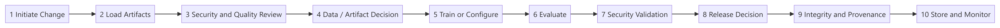
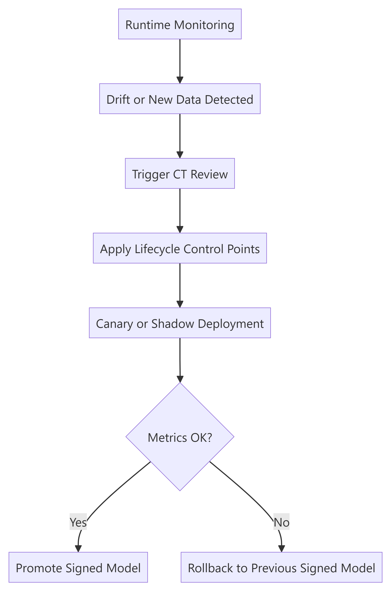

# Chapter 6: MLSecOps Lifecycle Control Model

> **Filename note:** This chapter is stored as `06-pipeline.md` for link stability. The content describes the **lifecycle control model**, not a reference CI/CD pipeline implementation.

## Control model objective

The `MLSecOps` lifecycle control model defines where security decisions, evidence collection, and review activities should occur across an AI system lifecycle. The goal is that no model, data, prompt template, `RAG` index, agent configuration, or other AI `Artifact` enters an operational environment without appropriate risk-based controls and auditable evidence.

This chapter is **not** a reference CI/CD implementation. It describes implementation-neutral control points that organizations may apply through MLOps platforms, CI/CD, manual approval workflows, managed AI service governance, or a combination of these mechanisms.

## Control model overview

The model begins with prerequisite `Planning` and `Threat Modeling`, then defines ten lifecycle control points from change initiation to storage and monitoring. **Not every control point is a blocking gate.** Some points produce evidence; others are explicit release decisions. The exact automation level depends on organizational maturity and architecture.

## Prerequisite: Planning and Threat Modeling

Before a release, retrain, index change, managed-model configuration change, or agent/tool change is approved, several activities must be completed; otherwise later decision points will lack precise criteria:

- Precise definition of system scope including data, model, API, `RAG`, agent, **MCP servers**, and **Shadow AI** usage (see [Ch.2 attack surface](02-scope-risk-threat-model.md#attack-surface-matrix))
- Threat modeling with `OWASP ML/LLM Top 10` and `MITRE ATLAS`
- Selection of mandatory controls and acceptable risk level
- Versioned recording of threat model output in `Evidence Pack`

## Lifecycle control points

| # | Control point | Security objective | Evidence / output |
|---|---|---|---|
| 1 | `Initiate Change` | Reliable and authorized start of a release, retrain, index update, or managed-service configuration change | Change record and scope |
| 2 | `Load Artifacts` | Secure loading of data, base model, and dependencies | `Manifest` and hashes |
| 3 | `Security & Quality Review` | Review code, data, model, dependencies, infrastructure, and managed-service configuration | Vulnerability and quality report |
| 4 | `Data / Artifact Decision Point` | Stop or escalate before training/configuration if high risk | `Go/No-Go` or exception decision |
| 5 | `Train or Configure` | Training, fine-tuning, RAG index update, or managed-model configuration in a traceable environment | Trained model, configuration record, or experiment log |
| 6 | `Evaluate Model` | Performance, fairness, and baseline evaluation | Evaluation report |
| 7 | `Security Validation` | Attack, backdoor, prompt injection, RAG leakage, and agent/tool misuse validation | Security validation report |
| 8 | `Release Decision` | Final security, business, and compliance review | Release approval, rejection, or risk acceptance |
| 9 | `Integrity and Provenance` | Model/artifact signing where applicable, managed-service configuration snapshot, provenance recording | Signature, attestation, or configuration evidence |
| 10 | `Store & Monitor` | Secure storage and monitoring activation | `Evidence Pack` and telemetry |

## Practical notes for each control point

| Control point | Practical note |
|---|---|
| 1. `Initiate Change` | Changes should originate from trusted events such as approved merge request, authorized commit, scheduled review, managed-service configuration change, RAG source update, or manual approval. |
| 2. `Load Artifacts` | Dataset, base model, notebook, and dependencies must be loaded from authorized sources; `ModelScan`, pickle check, and manifest generation including hashes must be done before training. |
| 3. `Security & Quality Review` | Review secrets, dependencies, notebooks, containers, IaC, model artifacts, and managed-service configuration using organization-approved tooling. Tool examples are informative only; validate behavior in your environment. |
| 4. `Data / Artifact Decision Point` | This decision point should block or escalate unmasked sensitive data, critical vulnerabilities, unauthorized data sources, or poisoned artifacts. |
| 5. `Train or Configure` | Training or configuration changes must run with least privilege; parameters, prompts, RAG source versions, and managed-service settings must be recorded. |
| 6. `Evaluate Model` | In addition to accuracy, check metrics such as `F1`, fairness, initial robustness, and baseline alignment. |
| 7. `Security Validation` | Classic models, LLM/RAG systems, agents, and MCP-enabled systems need different validation methods. Use a versioned test suite and acceptance criteria defined in the threat model. |
| 8. `Release Decision` | Security policies, compliance requirements, and business risk criteria must be reviewed before release. |
| 9. `Integrity and Provenance` | Models and controlled artifacts should be signed where possible; managed AI services should instead record approved service/model identifier, region, API version, configuration snapshot, and access policy. |
| 10. `Store & Monitor` | Final artifact stored in secure repository with object lock; telemetry including prompt, tool call, response, and model version sent to `SIEM/SOC`. |

## Release decision model

The model distinguishes between **evidence-producing control points** and **blocking release decisions**. Blocking decisions should be explicit, documented, and risk-based. If sensitive data is unmasked, a critical vulnerability exists, security validation fails, or policy review fails, release should be stopped unless an explicit, time-bound, approved exception is recorded.

| Type | Stage | Name | Role |
|---|---|---|---|
| **Release decision** | 4 | `Data / Artifact Decision Point` | Block or escalate on poisoned data, critical vulns, unauthorized sources, or unmasked PII |
| **Security validation decision** | 7 | `Security Validation` | Block release when adversarial, red-team, RAG leakage, or agent/tool acceptance criteria fail |
| **Final release decision** | 8 | `Release Decision` | Block release when compliance, business, or operational policy fails |
| **Integrity checkpoint** | 9 | `Integrity and Provenance` | Block storage/deploy when signature, attestation, verification, or managed-service configuration evidence is missing |
| Evidence-producing control point | 1–3, 5–6, 10 | Scan/review, train/configure, evaluate, monitor | Produce evidence; findings may affect decisions at 4, 7, or 8 |

**Minimum baseline (Level 1):** decision points at **4 and 8** must be explicit and documented; **stage 7 security validation runs on every release** and results are recorded. Stage 7 becomes a **blocking decision** at Level 2+ when acceptance thresholds are defined. Integrity/provenance evidence at **9** is mandatory at all levels, using signatures where the organization controls the artifact and configuration evidence where it consumes a managed AI service.

**Full production baseline (Level 2+):** all three decision points (4, 7, 8) are blocking on every release and CT cycle unless a formal, audited exception exists.

## Continuous Training cycle

After deployment, the model may need retraining due to `Data Drift`, new data, or performance decline. The `Continuous Training` cycle must not have security shortcuts. Retrained models must go through the same controls as the initial model.

In every `CT` cycle, **release decision points 4, 7, and 8** and **integrity verification at control point 9** must not be bypassed. Stages 1–3, 5–6, and 10 still run in full; their outputs feed the decision points above.

## CT cycle risks

| Risk | Recommended control |
|---|---|
| `Catastrophic Forgetting` | Run regression security test on fixed set |
| `Data Drift` | Statistical monitoring with defined threshold |
| `Adversarial Drift` | SOC analysis and manual review of suspicious data |
| `Model Collapse` | Limit synthetic data and monitor output diversity |
| Excessive retraining | Cap frequency and require human approval in sensitive cases |

## Control points in CT cycle

| Step | Control point | Status | Description |
|---|---|---|---|
| 1 | `Initiate Change` | Automatic or manual activation | By drift monitoring system, new data arrival, or approved change request |
| 2 | `Load Artifacts` | Full execution | Load new data, base model, and dependencies |
| 3 | `Security & Quality Scan` | Full execution | Scan new data, PII detection, and dependency review |
| 4 | `Data / Artifact Decision Point` | Mandatory decision | Data validation before training/configuration; no pass means stop or escalate |
| 5 | `Train or Configure` | Full execution | Retrain or reconfigure on new data with same constraints |
| 6 | `Evaluate Model` | Full execution | Evaluate performance and fairness of retrained model |
| 7 | `Security Validation` | Mandatory security decision (blocking at Level 2+) | Adversarial, prompt injection, backdoor, and ASR acceptance tests |
| 8 | `Release Decision` | Mandatory release decision | Approve compliance policies and acceptance criteria |
| 9 | `Integrity and Provenance` | Mandatory integrity checkpoint | Digital signing where applicable, managed-service configuration snapshot, and verify before promote |
| 10 | `Store & Monitor` | Full execution | Store new version and activate monitoring |

Basic CT cycle controls include validation of new data origin and quality, rescanning artifacts and dependencies, execution of the required decision points, integrity/provenance recording, and recording results in the `Evidence Pack`.

## Secure deployment methods for retrained models

| Method | Description |
|---|---|
| `Canary Deployment` | Only 1 to 5 percent of real traffic routed to new model; security and performance metrics compared with previous version. |
| `Shadow Mode` | New model runs alongside current model but its response is not delivered to user; used only to observe behavior. |
| `Automated Rollback` | If `Prompt Injection` rate, policy error, or performance decline exceeds threshold, system reverts to previous signed model. |

## Difference between Data Drift and Adversarial Drift

`Data Drift` is usually seen as change in feature distribution, `Embedding Drift`, or schema changes. In contrast, `Adversarial Drift` is often accompanied by spikes in suspicious prompts, abnormal tool calls, or suspicious session patterns. These two phenomena must have separate response playbooks.

## Alignment with MLOps lifecycle and OpenSSF

> **OpenSSF relationship:** The [OpenSSF Secure MLOps whitepaper (August 2025)](https://openssf.org/wp-content/uploads/2025/08/OpenSSF_MLSecOps_Whitepaper.pdf) defines a visual lifecycle and security measures across nine stages. **This guide is not an OpenSSF publication.** It is a complementary community reference that maps similar lifecycle stages to **explicit release decision points (4, 7, 8)**, integrity/provenance evidence (9), and an `Evidence Pack`. See the full OpenSSF stage-to-control mapping in [Chapter 11](11-governance-evidence.md).

| Standard `MLOps` stage | Equivalent control point in this guide |
|---|---|
| `Planning and Design` | Threat modeling and scope definition |
| `Data Engineering` | Artifact loading and control point 4 decision |
| `Experimentation` | Train or configure and experiment recording |
| `ML Pipeline Dev & Test` | Security and quality review and security validation |
| `CI` | Change recording and initial decision evidence |
| `CD` | Final approval, integrity/provenance evidence, and release preparation |
| `Continuous Training` | Retraining after monitoring |
| `Model Serving` | Runtime and inference infrastructure |
| `Continuous Monitoring` | Live monitoring and SOC integration |

## Common implementation challenges

| Challenge | Practical recommendation |
|---|---|
| Different nature of `DevSecOps` and `MLSecOps` threats | Define dedicated threat model for data, model, and inference. |
| Complexity of continuous retraining | Mandatory decision points **4, 7, 8** and integrity/provenance evidence at **9** in every CT cycle with canary deployment. |
| Opaque behavior inside models | Combine robustness testing, runtime monitoring, and human review for high-risk cases. |
| Risk of frequent retraining | Limit CT frequency and maintain fixed security baseline for comparison. |
| Output authenticity and reproducibility | Use `AI-BOM`, lineage, and signing integrally. |
| Difficulty of risk assessment | Separate operational risk from technical threat and produce `Evidence Pack` continuously. |

## Minimum security baseline

| Domain | Minimum control |
|---|---|
| Supply chain | Model scan with `ModelScan` and basic `SBOM/AI-BOM` generation |
| Integrity | Digital model signing and verify before deployment |
| Data | `Schema Validation` and `PII Detection & Masking` |
| Lifecycle decisions | Minimum: explicit documented decisions at **4 and 8**; stage **7** tests run every release (blocking decision at Level 2+); integrity/provenance evidence at **9** |
| Classic model | `ART` test and numerical `ASR` criterion at security validation |
| `LLM/RAG` | Automated `Prompt Injection` test and guardrail evaluation |
| Runtime | Deployment behind `Inference Gateway` |
| Monitoring | Send prompt, tool call, and model version to `SIEM/SOC` |
| Incident | Automated rollback and stable version snapshot |

## Lifecycle control prioritization

| Level | Controls |
|---|---|
| `MUST` (Level 1 minimum) | Artifact review, integrity/provenance evidence at stage 9, documented decisions at **4 and 8**, stage **7** security tests (recorded; blocking at Level 2+) |
| `MUST` (Level 2 production) | Blocking decisions at **4, 7, 8** + integrity/provenance evidence at **9** on every release and CT cycle |
| `SHOULD` | Automated `SBOM/AI-BOM` generation, canary in CT, automated `Evidence Pack` recording |
| `ADVANCED` | Full CT automation, advanced regression security test, and event mapping to `MITRE ATLAS` |

## Stage 7 test acceptance conditions

Acceptance thresholds must be defined and versioned in the organization's threat model; values below are examples, not fixed numbers for all systems:

| System type | Test Suite | Acceptance condition |
|---|---|---|
| Classic model | `ART` and backdoor evaluation | `ASR` and accuracy drop must be within threat model-defined thresholds. |
| `LLM/RAG` | `Prompt Injection` and retrieval leak probes | Bypass rate less than or equal to threat model threshold. |
| Agent | Tool misuse and output injection cases | No critical fail in fixed regression set allowed. |

## Red Team program and security test cadence

One-time security testing is not enough (Chapter 9). Red Team program must be versioned, repeatable, and have defined cadence:

| Test type | Example tool | Recommended cadence |
|---|---|---|
| Automated prompt injection / jailbreak test | `Garak`, `Promptfoo`, `PyRIT` | Every release (use a **smoke subset** each build; full suite on release/CT—avoid hitting production LLM APIs on every commit) |
| Classic model adversarial test | `ART` (FGSM, PGD, HopSkipJump—**vision/tabular-appropriate attacks only**; see Chapter 12) | Every new model and every CT |
| Manual / scenario-based Red Team | Internal or external team | Quarterly or before major release |
| Security regression test | Fixed versioned suite | Every build (automated) |
| Agent logic and tool misuse test | Custom scenarios | Every agent release |

Results of each run must be recorded in `Evidence Pack` with test suite hash for baseline comparison (Chapter 11).

## Implementation note

This guide intentionally does not provide a production-ready CI/CD implementation. In a practical implementation, controls should produce structured, reviewable evidence so a human approver, policy engine, MLOps platform, or release workflow can make a documented decision. If required evidence is missing, promotion should stop unless an explicit, audited exception is recorded.

Tool examples in Chapter 12 are informative and must be validated against the organization's environment before they are used for release decisions.

## Golden rule

No model, RAG index, agent configuration, or managed AI service configuration should reach `Production` without appropriate integrity/provenance evidence, `SBOM/AI-BOM` where applicable, documented release decisions, and an `Evidence Pack` or equivalent audit evidence bundle.

## Operational summary

1. No deploy is allowed without documented release decisions and integrity/provenance evidence.
2. Full scan of model files before training process is mandatory.
3. `CT` cycle must repeat the required lifecycle control points without shortcuts.
4. Retrained models must enter the real environment through canary path.
