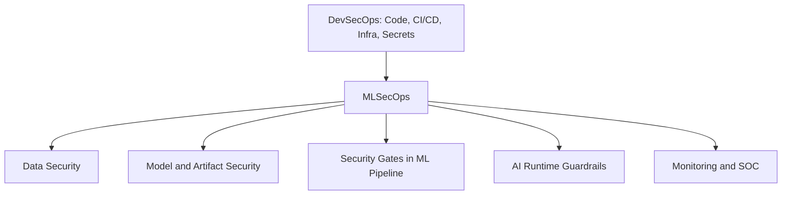
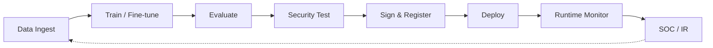

# فصل ۱: چکیده و مقدمه

## چکیده

`MLSecOps` یک معماری مرجع برای ایمن‌سازی سامانه‌های مبتنی بر هوش مصنوعی در تمام چرخه حیات آن‌هاست؛ از جمع‌آوری داده و آموزش مدل تا استقرار، اجرا، مانیتورینگ و پاسخ به رخداد. این رویکرد امنیت را از یک بررسی مقطعی قبل از انتشار، به یک فرآیند مهندسی‌شده، قابل اندازه‌گیری، قابل تکرار و قابل ممیزی تبدیل می‌کند.

تمرکز این راهنما بر تهدیدهای زنجیره تأمین هوش مصنوعی، حملات `Adversarial ML`، امنیت مدل‌های زبانی بزرگ، سامانه‌های `RAG`، عامل‌های هوشمند و کنترل‌های امنیتی در `Runtime` است. هدف ارائه یک معماری عملی برای تیم‌هایی است که سامانه‌های `ML` و `AI` را در محیط واقعی و عملیاتی توسعه یا نگهداری می‌کنند.

**مسئله:** کنترل‌های سنتی `DevSecOps` برای سامانه‌های AI کافی نیستند، چون ریسک‌های امنیتی فراتر از کد منبع به داده، مدل، پرامپت، embedding، pipeline بازیابی و عامل‌های خودمختار گسترش یافته‌اند. شکست‌های امنیتی در سامانه‌های AI عملیاتی اغلب خارج از لایه کد رخ می‌دهند؛ در داده آموزش، artifact مدل، indexهای `RAG` و رفتار runtime.

**روش:** این راهنما با تلفیق چارچوب‌های مرجع (`OWASP LLM/ML Top 10`، `MITRE ATLAS`، `NIST AI RMF`، `ISO/IEC 42001`، `OpenSSF MLSecOps`، `CSA MAESTRO`)، مطالعات موردی واقعی و الگوهای پیاده‌سازی عملیاتی تدوین شده است. این راهنما بر اساس چارچوب‌ها و دانش منتشرشده تا پایان سال ۲۰۲۵ تدوین شده است.

**یافته اصلی:** امنیت سامانه‌های AI زمانی قابل دفاع است که به‌صورت یک جریان پیوسته و قابل ممیزی از داده تا runtime و SOC دیده شود، نه به‌صورت کنترل‌های مقطعی.

**محدودیت‌ها:** این راهنما بر سامانه‌های ML/LLM/Agent سازمانی تمرکز دارد؛ حوزه‌های `Edge/IoT/CPS`، ایمنی (safety) و الزامات قانونی خاص هر صنعت تنها به‌اختصار پوشش داده شده‌اند و به منابع تخصصی نیاز دارند.

**کلیدواژه‌ها:** `MLSecOps`، `LLM Security`، `RAG Security`، `Agentic AI`، `Adversarial ML`، `AI Supply Chain`، `Model Signing`، `Security Pipeline`، `Evidence Pack`، `AI Governance`.

## مقدمه

در نرم‌افزارهای کلاسیک، `DevSecOps` توانست فاصله میان توسعه، عملیات و امنیت را کاهش دهد. اما سامانه‌های هوش مصنوعی چند ویژگی بنیادین دارند که باعث می‌شود همان مدل امنیتی برای آن‌ها کافی نباشد.

## چرا DevSecOps کافی نیست

| ویژگی | اثر امنیتی |
|---|---|
| وابستگی شدید به داده | کیفیت، حریم خصوصی و یکپارچگی داده مستقیماً رفتار مدل را تعیین می‌کند. |
| رفتار احتمالاتی | یک تست موفق، تضمین نمی‌کند همان حمله در `Production` تکرار نشود. |
| سطح حمله گسترده | علاوه بر کد، داده، مدل، `Artifact`، پرامپت، حافظه، ابزار و `Retrieval` نیز قابل حمله‌اند. |
| تغییرپذیری محیط | `Data Drift`، تغییر وابستگی‌ها و تغییر الگوهای کاربر می‌تواند مدل امن دیروز را امروز ناامن کند. |

رفتار احتمالاتی در سامانه‌های AI یک تفاوت امنیتی جدی ایجاد می‌کند. در نرم‌افزار کلاسیک، ورودی یکسان معمولاً خروجی یکسان می‌دهد؛ اما در مدل‌های AI، همان prompt یا همان داده می‌تواند بسته به context گفتگو، تنظیمات مدل مانند `temperature`، نسخه مدل یا داده بازیابی‌شده در `RAG` پاسخ متفاوت تولید کند. از نگاه امنیتی، این یعنی یک تست موفق تضمین نمی‌کند حمله در `Production` تکرار نشود؛ بسیاری از حملات مانند `Prompt Injection` فقط در ترکیب خاصی از context اثر می‌گذارند، نه مانند `SQL Injection` کلاسیک با یک ورودی ثابت و کاملاً قابل پیش‌بینی.

`MLSecOps` یعنی امنیت فقط یک مرحله پیش از انتشار نیست. امنیت باید در تمام نقاط تصمیم‌گیری چرخه حیات مدل اعمال شود: هنگام ورود داده، انتخاب مدل پایه، آموزش، ارزیابی، امضا، استقرار، دریافت درخواست کاربر، فراخوانی ابزار، بازیابی سند و مانیتورینگ رفتار مدل.

## سطح حمله AI (نمای اجرایی)

تهدیدها در سامانه‌های AI چند لایه را پوشش می‌دهند؛ نه فقط کد برنامه. جدول زیر تیم امنیت را قبل از تحلیل تفصیلی در فصل‌های بعد آماده می‌کند.

| لایه | نمونه ریسک‌ها |
|---|---|
| داده | `Data Poisoning`، نشت داده حساس، استخراج داده آموزش |
| مدل | `Backdoor`، دستکاری وزن، سرقت مدل، `Model Inversion` |
| کاربرد | `Prompt Injection`، مسمومیت `RAG`/`Retrieval`، `Tool Abuse`، خروجی ناامن |
| Runtime | `Data Drift`، evasion، دور زدن guardrail، اقدامات بدون مانیتور agent |

> طبقه‌بندی کامل تهدیدها: [فصل ۳](03-threat-landscape.md). threat model عملیاتی و scope: [فصل ۲](02-scope-risk-threat-model.md).

## اصول MLSecOps

این اصول نحوه تصمیم‌گیری امنیتی در چرخه حیات AI را تعریف می‌کنند:

| # | اصل | خلاصه |
|---|---|---|
| ۱ | **شواهد قبل از استقرار** | هیچ artifact هوش مصنوعی بدون شواهد امنیتی قابل ردیابی وارد production نشود. |
| ۲ | **Security gate قبل از promotion** | آموزش، ارزیابی، امضا و deploy فقط پس از عبور معیارهای `Go/No-Go` تعریف‌شده. |
| ۳ | **اعتبارسنجی پیوسته runtime** | رفتار production مانیتور شود؛ drift، injection و tool abuse شناسایی و پاسخ داده شود. |
| ۴ | **زنجیره تأمین AI قابل ردیابی** | `SBOM`، `AI-BOM`، امضا و provenance مبدأ مدل، lineage داده و تاریخچه تست را ثبت کنند. |
| ۵ | **کنترل‌های threat-modeled** | کنترل‌ها با معماری و ریسک هم‌خوان باشند؛ نه چک‌لیست عمومی AI security. |
| ۶ | **فرآیند قابل سنجش، تکرار و ممیزی** | تصمیم‌های امنیتی با معیار مشخص، در هر build یا retrain، و با سابقه قابل بررسی. |

**اصل ۱ در عمل:** شواهد باید نشان دهد داده از کجا آمده، مدل چگونه ساخته شده، چه تست‌هایی اجرا شده، چه کسی انتشار را تأیید کرده، چه `Artifact`هایی امضا شده‌اند و در زمان اجرا چه رفتارهایی مانیتور می‌شوند.

## نسبت MLSecOps با DevSecOps

`DevSecOps` پایه امنیت کد، زیرساخت، وابستگی‌ها، کانتینرها، اسرار و `CI/CD` را فراهم می‌کند. `MLSecOps` این پایه را برای دارایی‌های خاص هوش مصنوعی گسترش می‌دهد: داده، مدل، `Feature Store`، `Model Registry`، `Prompt`، `Embedding`، `Vector DB`، `RAG` و عامل‌های هوشمند.

| بعد | `DevSecOps` | `MLSecOps` |
|---|---|---|
| دارایی اصلی | کد، image، dependency | داده، مدل، embedding، prompt |
| artifact زنجیره تأمین | package، container image | وزن مدل، dataset، vector index، prompt template |
| تست امنیتی | SAST، SCA، DAST | adversarial test، red team LLM، backdoor scan |
| سطح حمله | API، container، IaC | inference API، RAG، agent tool، GPU memory |
| کنترل promotion | gate روی build و deploy | gate قبل از train، evaluate، sign و deploy |
| مانیتورینگ | log، metric، alert | drift، prompt injection، tool abuse |
| شواهد | SBOM، attestation | SBOM + `AI-BOM`، model signing، `Evidence Pack` |

`MLSecOps` جایگزین `DevSecOps` نیست؛ بدون `DevSecOps` محکم، `MLSecOps` پایدار نمی‌ماند. هر دو باید در pipeline یکپارچه شوند.

### شواهد زنجیره تأمین AI (`AI-BOM`)

`AI-BOM`، `SBOM` را برای artifactهای خاص AI گسترش می‌دهد. حداقل باید مبدأ مدل، lineage dataset، framework آموزش، تاریخچه fine-tuning، وابستگی‌ها، نتایج ارزیابی، تست‌های امنیتی و artifact استقرار را توصیف کند. الزامات کامل، ابزارها و ادغام pipeline در [فصل ۵](05-model-artifact-supply-chain.md) آمده است.

## نمای کلی چرخه حیات

هر مرحله در این چرخه حیات به security gate، جمع‌آوری شواهد و کنترل‌های [فصل ۶](06-pipeline.md) نگاشت می‌شود.

## تمرکز این راهنما و تفکیک از AISecOps

این راهنما به‌طور خاص بر `MLSecOps` تمرکز دارد: امنیت تمام چرخه حیات سامانه‌های `ML/AI` از داده و آموزش تا artifact، pipeline، استقرار، runtime و مانیتورینگ.

لازم است `MLSecOps` با اصطلاح مشابه `AISecOps` اشتباه گرفته نشود، چون این دو دو حوزه متفاوت‌اند:

| اصطلاح | تعریف | پرسش محوری |
|---|---|---|
| `MLSecOps` | امنیت چرخه حیات مدل و سامانه‌های هوش مصنوعی (موضوع این راهنما) | «چگونه یک سامانه AI را امن بسازم، منتشر و اجرا کنم؟» |
| `AISecOps` | استفاده از هوش مصنوعی در خود عملیات امنیتی؛ یعنی به‌کارگیری AI برای تشخیص تهدید، triage هشدار، تحلیل و پاسخ خودکار در `SOC` (طبق تعریف NSFOCUS، تلفیق `AIOps` + `AISec` + `SecOps`) | «چگونه از AI برای خودکارسازی عملیات امنیتی استفاده کنم؟» |

به‌بیان ساده: `MLSecOps` یعنی «امن‌کردن هوش مصنوعی»، اما `AISecOps` یعنی «استفاده از هوش مصنوعی برای امنیت». این راهنما کاملاً در حوزه `MLSecOps` است و وارد قلمرو `AISecOps` نمی‌شود؛ هرچند در فصل ۱۰ که به اتصال با `SOC` می‌پردازد، نقطه تماس عملی این دو حوزه دیده می‌شود.

به‌اختصار، `MLSecOps` همان منطق `DevSecOps` است، اما برای امنیت داده، مدل، `Pipeline`، `Runtime` و رفتار سامانه‌های هوش مصنوعی، نه فقط کد و زیرساخت.

