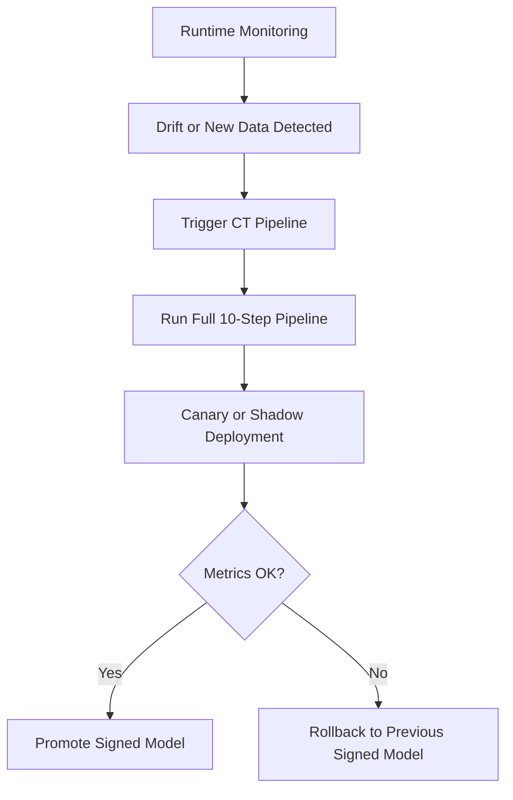

# فصل ۶: پایپ‌لاین ده‌مرحله‌ای MLSecOps

## هدف پایپ‌لاین

پایپ‌لاین `MLSecOps` امنیت را به‌صورت مداوم و خودکار در چرخه ساخت، ارزیابی، امضا، استقرار و مانیتورینگ مدل وارد می‌کند. هدف این است که هیچ مدل، داده یا `Artifact` بدون عبور از کنترل‌های امنیتی و تولید شواهد قابل ممیزی وارد محیط عملیاتی نشود.

## نمای کلی پایپ‌لاین

این پایپ‌لاین از یک فعالیت پیش‌نیاز (`Planning` و `Threat Modeling`) آغاز می‌شود و سپس ده مرحله اصلی را شامل می‌شود؛ از `Trigger` تا `Store & Monitor`. در هر نقطه حساس یک `Security Gate` قرار دارد که در صورت شکست، انتشار را متوقف می‌کند. نمودار جریان مراحل در ادامه آمده و جزئیات هر مرحله در بخش‌های بعدی توضیح داده شده است.

## پیش‌نیاز: Planning و Threat Modeling

قبل از trigger شدن پایپ‌لاین، چند فعالیت باید انجام شده باشد؛ وگرنه gateهای بعدی معیار دقیق نخواهند داشت:

- تعریف دقیق محدوده سیستم شامل داده، مدل، API، `RAG` و agent
- مدل‌سازی تهدید با `OWASP ML/LLM Top 10` و `MITRE ATLAS`
- انتخاب کنترل‌های اجباری و تعیین سطح ریسک پذیرفتنی
- ثبت نسخه‌شده خروجی مدل تهدید در `Evidence Pack`

```mermaid
flowchart LR
    A[1 Trigger] --> B[2 Load Artifacts]
    B --> C[3 Security and Quality Scan]
    C --> D[4 Quality Gate 1]
    D --> E[5 Train Model]
    E --> F[6 Evaluate Model]
    F --> G[7 Final Security Testing]
    G --> H[8 Final Quality Gate]
    H --> I[9 Sign Model]
    I --> J[10 Store and Monitor]
```

## مراحل پایپ‌لاین

| مرحله | نام | هدف امنیتی | خروجی |
|---|---|---|---|
| ۱ | `Trigger Pipeline` | شروع قابل اعتماد و قابل تکرار | لاگ رویداد و نسخه پایپ‌لاین |
| ۲ | `Load Artifacts` | بارگذاری امن داده، مدل پایه و وابستگی‌ها | `Manifest` و هش‌ها |
| ۳ | `Security & Quality Scan` | اسکن کد، داده، مدل، وابستگی‌ها و IaC | گزارش آسیب‌پذیری و کیفیت |
| ۴ | `Quality Gate 1` | توقف قبل از آموزش در صورت ریسک بالا | تصمیم `Go/No-Go` |
| ۵ | `Train Model` | آموزش در محیط ایزوله و قابل ردیابی | مدل آموزش‌دیده و لاگ آزمایش |
| ۶ | `Evaluate Model` | ارزیابی عملکرد، fairness و baseline | گزارش ارزیابی |
| ۷ | `Final Security Testing` | تست حملات، backdoor و prompt injection | گزارش امنیتی کامل |
| ۸ | `Final Quality Gate` | بررسی نهایی سیاست‌ها و انطباق | تأیید انتشار |
| ۹ | `Sign Model` | امضای مدل و ثبت provenance | مدل امضاشده و attestation |
| ۱۰ | `Store & Monitor` | ذخیره امن و فعال‌سازی مانیتورینگ | `Evidence Pack` و telemetry |

## نکات عملی هر مرحله

| مرحله | نکته عملی |
|---|---|
| ۱. `Trigger Pipeline` | پایپ‌لاین فقط باید با رویدادهای قابل اعتماد مثل merge request، commit مجاز، schedule معتبر یا manual approval فعال شود. webhookها باید امن و امضاشده باشند. |
| ۲. `Load Artifacts` | dataset، مدل پایه، notebook و dependencyها باید از منابع مجاز بارگذاری شوند؛ `ModelScan`، بررسی pickle و تولید manifest شامل hashها قبل از آموزش انجام شود. |
| ۳. `Security & Quality Scan` | علاوه بر SAST و SCA، ابزارهایی مانند `Gitleaks`، `Trivy`، `NB Defense`، `Checkov`/`tfsec` (برای IaC) و `lintML` (linter امنیتی ML از Nvidia) برای secret، container، notebook و کد ML استفاده شوند. |
| ۴. `Quality Gate 1` | این gate قبل از آموزش جلوی داده حساس ماسک‌نشده، آسیب‌پذیری بحرانی یا artifact آلوده را می‌گیرد. |
| ۵. `Train Model` | آموزش باید در sandbox و با least privilege انجام شود؛ پارامترها و آزمایش‌ها با ابزارهایی مانند `MLflow` ثبت شوند. |
| ۶. `Evaluate Model` | علاوه بر accuracy، معیارهایی مانند `F1`، fairness، robustness اولیه و تطابق با baseline بررسی شوند. |
| ۷. `Final Security Testing` | برای مدل کلاسیک از `ART` و برای `LLM/RAG/Agent` از تست‌هایی مانند `Promptfoo`، `Garak` یا regression set ثابت استفاده شود. |
| ۸. `Final Quality Gate` | سیاست‌های امنیتی، انطباق و معیارهای کسب‌وکاری باید قبل از امضا تأیید شوند. |
| ۹. `Sign Model` | مدل و artifactها با ابزارهایی مانند `Cosign` یا `Sigstore` امضا شوند و attestation شامل `AI-BOM/SBOM`، نتایج gateها و threat model باشد. |
| ۱۰. `Store & Monitor` | artifact نهایی در مخزن امن با object lock ذخیره شود و telemetry شامل prompt، tool call، response و نسخه مدل به `SIEM/SOC` ارسال شود. |

## Security Gates

در این پایپ‌لاین، `Gate`ها نقاط توقف واقعی هستند، نه صرفاً هشدار. اگر داده حساس ماسک نشده باشد، آسیب‌پذیری بحرانی وجود داشته باشد، تست امنیتی شکست بخورد یا امضای مدل معتبر نباشد، انتشار باید متوقف شود.

| Gate | زمان اجرا | دلیل اهمیت |
|---|---|---|
| `Quality Gate 1` | پیش از آموزش | جلوگیری از مصرف داده یا وابستگی آلوده |
| `Final Security Testing` | پس از آموزش | سنجش مقاومت مدل و رفتار ناامن |
| `Final Quality Gate` | پیش از امضا | بررسی سیاست، ریسک و انطباق |
| `Sign Model` | پیش از ذخیره نهایی | تضمین اصالت و جلوگیری از tampering |

## چرخه Continuous Training

پس از استقرار، ممکن است به دلیل `Data Drift`، داده جدید یا افت عملکرد، مدل نیازمند بازآموزی شود. چرخه `Continuous Training` نباید میان‌بر امنیتی داشته باشد. مدل بازآموزی‌شده باید همان کنترل‌های مدل اولیه را طی کند.

gateهای ۴، ۷، ۸ و ۹ در چرخه `CT` حیاتی هستند و تحت هیچ شرایطی نباید دور زده شوند.

## ریسک‌های چرخه CT

| ریسک | کنترل پیشنهادی |
|---|---|
| `Catastrophic Forgetting` | اجرای regression security test روی مجموعه ثابت |
| `Data Drift` | پایش آماری با آستانه مشخص |
| `Adversarial Drift` | تحلیل SOC و بررسی دستی داده‌های مشکوک |
| `Model Collapse` | محدود کردن داده synthetic و پایش تنوع خروجی |
| بازآموزی بیش از حد | سقف‌گذاری فرکانس و نیاز به تأیید انسانی در موارد حساس |

## مراحل اجرا در چرخه CT

| گام | مرحله | وضعیت | توضیح |
|---|---|---|---|
| ۱ | `Trigger Pipeline` | فعال‌سازی خودکار | توسط سیستم پایش drift یا ورود داده جدید |
| ۲ | `Load Artifacts` | اجرای کامل | بارگذاری داده جدید، مدل پایه و وابستگی‌ها |
| ۳ | `Security & Quality Tools` | اجرای کامل | اسکن داده جدید، PII detection و بررسی وابستگی‌ها |
| ۴ | `Quality Gate 1` | گیت اجباری | اعتبارسنجی داده پیش از آموزش؛ بدون عبور یعنی stop |
| ۵ | `Train Model` | اجرای کامل | بازآموزی روی داده جدید با همان محدودیت‌ها |
| ۶ | `Evaluation Model` | اجرای کامل | ارزیابی عملکرد و fairness مدل بازآموزی‌شده |
| ۷ | `Final Security Testing` | گیت اجباری | تست adversarial، prompt injection، backdoor و ASR acceptance |
| ۸ | `Final Quality Gate` | گیت اجباری | تأیید سیاست‌های انطباق و معیارهای پذیرش |
| ۹ | `Sign Model` | گیت اجباری | امضای دیجیتال مدل جدید با کلید امن |
| ۱۰ | `Store & Monitor` | اجرای کامل | ذخیره نسخه جدید و فعال‌سازی مانیتورینگ |

کنترل‌های پایه چرخه CT شامل اعتبارسنجی مبدأ و کیفیت داده جدید، اسکن مجدد artifactها و وابستگی‌ها، اجرای کامل policy gateها، امضای دیجیتال مدل بازآموزی‌شده و ثبت خودکار نتایج در `Evidence Pack` است.

## روش‌های استقرار امن مدل بازآموزی‌شده

| روش | توضیح |
|---|---|
| `Canary Deployment` | فقط ۱ تا ۵ درصد ترافیک واقعی به مدل جدید هدایت شود و متریک‌های امنیتی و عملکردی با نسخه قبلی مقایسه گردد. |
| `Shadow Mode` | مدل جدید کنار مدل فعلی اجرا شود، اما پاسخ آن به کاربر تحویل داده نشود؛ فقط برای مشاهده رفتار استفاده شود. |
| `Automated Rollback` | اگر نرخ `Prompt Injection`، خطای policy یا افت عملکرد از آستانه عبور کرد، سیستم به مدل امضاشده قبلی برگردد. |

## تفاوت Data Drift و Adversarial Drift

`Data Drift` معمولاً با تغییر توزیع ویژگی‌ها، `Embedding Drift` یا تغییرات schema دیده می‌شود. در مقابل، `Adversarial Drift` اغلب با جهش در promptهای مشکوک، tool callهای غیرعادی یا الگوهای مشکوک session همراه است. این دو پدیده باید playbook واکنشی جداگانه داشته باشند.

## تطبیق با چرخه MLOps

| مرحله استاندارد `MLOps` | گام معادل در پایپ‌لاین این مقاله |
|---|---|
| `Planning and Design` | مدل‌سازی تهدید و تعیین محدوده |
| `Data Engineering` | بارگذاری artifact و gate تأیید داده |
| `Experimentation` | آموزش مدل و ثبت آزمایش |
| `ML Pipeline Dev & Test` | اسکن کد و تست امنیتی نهایی |
| `CI` | ثبت رویداد تا تأیید gate اولیه |
| `CD` | تأیید نهایی، امضا و آماده‌سازی انتشار |
| `Continuous Training` | بازآموزی پس از مانیتورینگ |
| `Model Serving` | runtime و زیرساخت inference |
| `Continuous Monitoring` | پایش زنده و اتصال به SOC |

## چالش‌های رایج پیاده‌سازی

| چالش | توصیه عملی |
|---|---|
| تفاوت ماهیت تهدیدهای `DevSecOps` و `MLSecOps` | threat model اختصاصی برای داده، مدل و inference تعریف شود. |
| پیچیدگی بازآموزی مداوم | gateهای ۴، ۷، ۸ و ۹ همراه با canary در هر CT اجباری باشند. |
| مبهم بودن رفتار درون مدل‌ها | robustness testing، runtime monitoring و human review برای موارد پرریسک ترکیب شوند. |
| ریسک بازآموزی مکرر | فرکانس CT محدود شود و baseline امنیتی ثابت برای مقایسه نگه داشته شود. |
| اصالت خروجی و قابلیت بازتولید | `AI-BOM`، lineage و signing به‌صورت یکپارچه استفاده شوند. |
| دشواری ارزیابی ریسک | ریسک عملیاتی از تهدید فنی تفکیک و `Evidence Pack` مستمر تولید شود. |

## حداقل خط‌مبنای امنیتی

| حوزه | حداقل کنترل |
|---|---|
| زنجیره تأمین | اسکن مدل با `ModelScan` و تولید پایه‌ای `SBOM/AI-BOM` |
| یکپارچگی | امضای دیجیتال مدل و verify پیش از استقرار |
| داده | `Schema Validation` و `PII Detection & Masking` |
| پایپ‌لاین | حداقل یک gate سیاست‌گذاری خودکار در مراحل ۴ و ۸ |
| مدل کلاسیک | تست `ART` و معیار عددی `ASR` در gate ۷ |
| `LLM/RAG` | تست خودکار `Prompt Injection` و ارزیابی guardrail |
| Runtime | استقرار پشت `Inference Gateway` |
| پایش | ارسال prompt، tool call و نسخه مدل به `SIEM/SOC` |
| رخداد | rollback خودکار و snapshot نسخه پایدار |

## اولویت‌بندی کنترل‌های پایپ‌لاین

| سطح | کنترل‌ها |
|---|---|
| `MUST` | `ModelScan`، امضای دیجیتال، gateهای ۴ و ۸، تست امنیتی مرحله ۷ |
| `SHOULD` | تولید خودکار `SBOM/AI-BOM`، canary در CT، ثبت خودکار `Evidence Pack` |
| `ADVANCED` | اتوماسیون کامل CT، regression security test پیشرفته و نگاشت رویدادها به `MITRE ATLAS` |

## شرط قبولی تست‌های مرحله ۷

آستانه‌های قبولی باید در مدل تهدید سازمان تعریف و نسخه‌گذاری شوند؛ مقادیر زیر نمونه‌اند، نه عدد ثابت برای همه سامانه‌ها:

| نوع سیستم | Test Suite | شرط قبولی |
|---|---|---|
| مدل کلاسیک | `ART` و backdoor evaluation | `ASR` و افت دقت باید در آستانه تعریف‌شده مدل تهدید باشند. |
| `LLM/RAG` | `Prompt Injection` و retrieval leak probes | bypass rate کمتر یا مساوی آستانه threat model باشد. |
| Agent | tool misuse و output injection cases | هیچ critical fail در regression set ثابت مجاز نیست. |

## برنامه Red Team و تناوب تست امنیتی

تست امنیتی یک‌باره کافی نیست (فصل ۹). برنامه Red Team باید نسخه‌دار، تکرارپذیر و دارای cadence مشخص باشد:

| نوع تست | ابزار نمونه | تناوب پیشنهادی |
|---|---|---|
| تست خودکار prompt injection / jailbreak | `Garak`، `Promptfoo`، `PyRIT` | هر build و هر تغییر prompt/مدل |
| تست adversarial مدل کلاسیک | `ART` (FGSM، PGD، HopSkipJump) | هر مدل جدید و هر CT |
| Red Team دستی / سناریومحور | تیم داخلی یا خارجی | فصلی یا پیش از release بزرگ |
| تست regression امنیتی | suite ثابت نسخه‌دار | هر build (خودکار) |
| تست منطق agent و tool misuse | سناریوهای سفارشی | هر agent release |

نتایج هر اجرا باید همراه hash مجموعه تست در `Evidence Pack` ثبت شود تا قابل مقایسه با baseline باشد (فصل ۱۱).

## الگوی رفتار مورد انتظار در pipeline

در یک پیاده‌سازی عملی، هر ابزار باید یا از طریق `exit code` غیرصفر، pipeline را متوقف کند (`fail-closed`) یا خروجی ساختاریافته (معمولاً JSON) تولید کند تا یک policy engine مانند `OPA`/`Conftest` بتواند آن را ارزیابی نماید. جزئیات ابزارها و الگوی اتصال آن‌ها در فصل ۱۲ آمده است. خواننده می‌تواند با مراجعه به مستندات رسمی هر ابزار (`ModelScan`، `Garak`، `Promptfoo` و `Sigstore`) و فصل ۱۲، pipeline متناسب با CI/CD خود را بسازد.

برای جزئیات نصب، دستورها و رفتار دقیق هر ابزار به «راهنمای عملی ابزارها» در فصل ۱۲ مراجعه کنید.

## اصل طلایی

هیچ مدل نباید بدون امضای دیجیتال، `SBOM/AI-BOM`، عبور موفق از `Policy Gate`ها و تولید `Evidence Pack` به `Production` برسد.

## خلاصه عملیاتی

1. هیچ deploy بدون عبور از gateهای نظارتی و ثبت امضای دیجیتال مجاز نیست.
2. اسکن کامل فایل‌های مدل قبل از فرآیند آموزش الزامی است.
3. چرخه `CT` باید همه مراحل و gateهای امنیتی پایپ‌لاین اصلی را بدون میان‌بر تکرار کند.
4. مدل‌های بازآموزی‌شده باید از مسیر canary وارد محیط واقعی شوند.

