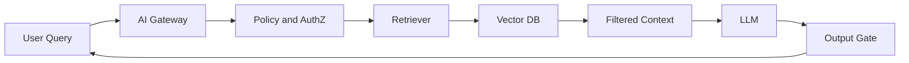
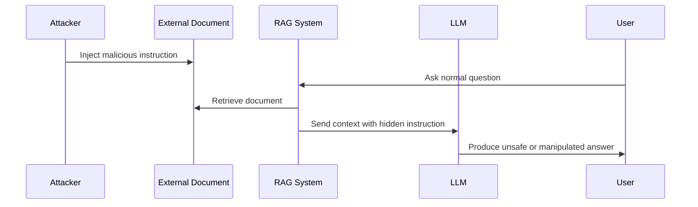

# فصل ۷: امنیت LLM و RAG

## تفاوت امنیت LLM با ML کلاسیک

در مدل‌های کلاسیک، تمرکز امنیت بیشتر روی داده آموزشی، مدل، ورودی عددی یا تصویری و `Artifact` است. اما در سامانه‌های `LLM` و `RAG` بخش بزرگی از ریسک به زمان اجرا منتقل می‌شود. مدل با کاربر، سند، ابزار، حافظه و سیاست‌های سازمانی در تعامل است و هر کدام می‌توانند سطح حمله باشند.

## تهدیدهای اصلی LLM

| تهدید | توضیح | کنترل |
|---|---|---|
| `Prompt Injection` | دور زدن دستورالعمل‌ها یا تغییر رفتار مدل | `System Prompt` سخت‌گیرانه، `Gateway`، تست red team |
| `Sensitive Information Disclosure` | افشای داده حساس یا محرمانه | `DLP`، کنترل context، محدودیت خروجی |
| `Insecure Output Handling` | استفاده ناامن از خروجی مدل توسط سیستم دیگر | اعتبارسنجی خروجی و sandbox |
| `Overreliance` | اعتماد بیش از حد به پاسخ مدل | `Human Review` و توضیح‌پذیری |
| `Model Denial of Service` | مصرف زیاد token یا درخواست‌های پرهزینه | rate limit و quota |

## کنترل‌های امنیتی برای LLM

امنیت مدل‌های زبانی فقط با نصب یک ابزار حل نمی‌شود. مجموعه‌ای از قابلیت‌ها باید در کنار هم عمل کنند:

| کنترل | توضیح |
|---|---|
| راهنماهای زمان اجرا و فیلتر prompt | ابزارهایی مانند `NeMo Guardrails`، `Lakera Guard` یا gateway داخلی promptهای ورودی را پیش از ارسال به مدل بررسی می‌کنند. |
| `Pre-Inference Scanning` | ورودی‌ها از نظر الگوهای مخرب، تلاش برای bypass یا وجود داده حساس اسکن می‌شوند. |
| مدیریت خروجی و risk scoring | خروجی مدل از نظر نشت اطلاعات بررسی و در صورت نیاز block، redact یا review می‌شود. |
| `AI Gateway` | نقطه ورود واحد برای اعمال سیاست‌های امنیتی، rate limit، logging و کنترل دسترسی. |
| `Session Risk Scoring` | رفتار کاربر در طول نشست تحلیل می‌شود و در صورت الگوی مشکوک، سطح پاسخ یا دسترسی محدود می‌شود. |
| تشخیص ناهنجاری prompt | تغییر ناگهانی ساختار، طول یا محتوای prompt نسبت به رفتار معمول شناسایی می‌شود. |
| `Egress Filtering` | تلاش برای خروج داده حساس از طریق پاسخ مدل یا ابزارها مسدود می‌شود. |

## معماری امن برای RAG

## امنیت Ingest در RAG

در `RAG`، هر سندی که وارد پایگاه دانش می‌شود می‌تواند بعدها در پاسخ مدل اثر بگذارد. بنابراین `Ingest Pipeline` باید مثل یک مرز امنیتی جدی دیده شود.

کنترل‌های ضروری:

- فقط منابع مجاز وارد index شوند.
- اسناد پیش از index شدن از نظر محتوای مخرب و داده حساس بررسی شوند.
- سطح دسترسی سند همراه با embedding ذخیره شود.
- داده هر tenant جدا نگهداری شود.
- تغییرات سند نسخه‌گذاری و قابل ردیابی باشد.

## کنترل‌های سه‌لایه در RAG

| لایه | کنترل |
|---|---|
| `Retriever` | source allowlist، integrity check، بررسی hash و امضای منبع سند |
| `Reranker` | امتیازدهی امنیتی همراه relevance و حذف سندهای با امتیاز امنیتی پایین |
| `Context` | جداسازی `System Prompt`، `User Prompt` و `Retrieved Context`، محدودیت طول و sanitization پیش از الحاق به prompt |

## Retrieval Poisoning

در `Retrieval Poisoning` مهاجم سند یا محتوایی وارد منبع دانش می‌کند که باعث بازیابی context مخرب یا جهت‌دار شود. این حمله خطرناک است، چون کاربر ممکن است هیچ prompt مخربی نفرستاده باشد، اما مدل از سند آلوده دستور بگیرد.

| نقطه شکست | پیامد | کنترل |
|---|---|---|
| ingest بدون بررسی | ورود سند آلوده | اسکن و approval |
| نبود ACL در retrieval | افشای سند نامجاز | authorization در query time |
| index مشترک بین tenantها | نشت داده بین مشتریان | index جداگانه |
| نبود پاک‌سازی | ماندگاری آلودگی | re-index و lifecycle policy |

## Embedding Poisoning

سناریوی نمونه: مهاجم سندی آلوده را از طریق webhook، upload کاربر یا sync خودکار وارد سیستم می‌کند. این سند پس از تبدیل به embedding به پرسش‌هایی ظاهراً بی‌ربط نزدیک می‌شود و در زمان inference به‌عنوان context بازیابی می‌گردد.

| مرحله | حمله | کنترل فنی |
|---|---|---|
| `Ingestion` | ورود سند آلوده | source allowlist، اسکن ضدویروس و metadata، تأیید انسانی برای منبع جدید، quarantine bucket |
| `Index` | ذخیره بردار آلوده | hash محتوا پیش از index، نسخه‌گذاری index، index جدا برای هر tenant |
| `Retrieval` | انحراف در top-k | reranking با سیگنال امنیتی، حداقل تعداد منابع، block کردن cluster مشکوک |
| `Response` | اجرای دستور از context | citation اجباری، grounding check و output gate |

## Reindex Playbook

1. شناسایی دسته آلوده با استفاده از `Lineage`.
2. حذف آن دسته از index.
3. بازتولید embeddingها با مدل embedding تأییدشده.
4. اجرای تست regression امنیتی برای prompt و RAG پیش از انتشار index جدید.

## استقرار Cloud Native و Multi-Tenant

| لایه | کنترل | نمونه پیاده‌سازی |
|---|---|---|
| شناسایی tenant | هر درخواست باید `Tenant ID` معتبر داشته باشد | `JWT Claim` یا header امضاشده |
| Kubernetes RBAC | namespace جدا برای workload مدل | `Role`، `RoleBinding` و service account مجزا |
| شبکه | فقط gateway به pod inference دسترسی داشته باشد | default deny egress |
| Service Mesh | mTLS و authorization | `Istio` یا `Linkerd` |
| Vector DB | جداسازی فیزیکی indexها | پرهیز از metadata filter روی index مشترک |
| Inference مشترک | quota و queue به ازای tenant | rate limit و جلوگیری از نشت cache |

در سناریوهای `vLLM` یا GPU اشتراکی، وزن مدل می‌تواند مشترک باشد، اما context و `KV Cache` هرگز نباید بین tenantها مشترک باشد. session stickiness و پاک‌سازی cache پس از پایان نشست باید اجباری باشد.

## هاردنینگ پیشرفته Multi-Tenant

| ریسک | کنترل |
|---|---|
| `KV Cache Leak` | partition بر اساس tenant و پاک‌سازی پس از نشست |
| `GPU Colocation` | استفاده از `MIG` یا GPU اختصاصی برای رده‌های حساس |
| `Model Multiplexing` | batching آگاه از tenant و جداسازی با padding |
| `Speculative Decoding` | جداسازی state پیش‌نویس یا غیرفعال‌سازی حالت مشترک |
| `Tokenizer Timing Side-Channel` | rate limit، padding ثابت و ممیزی ناهنجاری زمانی |
| `Shared Inference Cache` | کلید cache شامل tenant ID و hash prompt باشد |

## ریسک‌های Fine-tuning

| تهدید | ریسک امنیتی | کنترل |
|---|---|---|
| `Model Collapse` | خروجی تکراری، افت کیفیت و شکست policyهای safety | سقف داده synthetic، ارزیابی تنوع خروجی، اجرای gate ۷ بعد از هر fine-tuning |
| `Overrefusal` | کاربران به سمت bypass technique سوق داده می‌شوند | اندازه‌گیری false positive block، تست usability امن و تنظیم آستانه policy |

منابع پژوهشی مربوط به `Model Collapse` مانند Shumailov et al. و راهنماهای `OWASP LLM` درباره `Overrefusal` نشان می‌دهند که این دو موضوع فقط مسئله کیفیت پاسخ نیستند؛ هر دو می‌توانند مستقیماً روی امنیت و امکان bypass کنترل‌ها اثر بگذارند.

## System Prompt Leakage (LLM07)

در `System Prompt Leakage` مهاجم یا کاربر تلاش می‌کند دستورالعمل‌های سیستمی، policy داخلی، نام ابزارها یا قوانین moderation را استخراج کند. این افشا می‌تواند bypass بعدی را آسان‌تر کند.

| بردار | کنترل |
|---|---|
| درخواست صریح «دستورالعمل‌هایت را تکرار کن» | output gate و blocklist الگو |
| استخراج تدریجی در چند turn | session risk scoring و rate limit |
| نشت از طریق error message یا stack trace | sanitization خطا و جداسازی debug از production |

## تکنیک‌های پیشرفته Prompt Injection

علاوه بر prompt متنی ساده، حملات زیر در محیط production گزارش شده‌اند:

| تکنیک | توضیح | کنترل |
|---|---|---|
| `Token Smuggling` | پنهان‌کردن دستور در tokenization یا encoding غیرمعمول | normalisation ورودی، tokenizer audit |
| `ASCII Art Bypass` | دستور مخرب به‌صورت کاراکترهای ASCII art که فیلتر متنی را دور می‌زند | OCR/multimodal scan، pattern detection |
| `Invisible Unicode` | استفاده از بلوک `TAG` یونیکد (`U+E0000–U+E007F`) برای متن پنهان | Unicode normalisation، character whitelist |
| `Markdown/HTML Injection` | لینک یا comment پنهان در سند بازیابی‌شده | strip HTML، plain-text context |
| `Many-shot Jailbreak` | تکرار نمونه‌های jailbreak در context طولانی | context length limit، moderation چندمرحله‌ای |

## Prompt Injection مستقیم و غیرمستقیم

`Prompt Injection` مستقیم زمانی رخ می‌دهد که کاربر صریحاً دستور مخرب ارسال کند. `Prompt Injection` غیرمستقیم زمانی رخ می‌دهد که دستور مخرب داخل یک منبع خارجی پنهان شود و از طریق `RAG` یا ابزار وارد context مدل گردد.

نمونه مسیر حمله:

## Guardrailها

`Guardrail`ها باید هم قبل از مدل و هم بعد از مدل اجرا شوند. کنترل قبل از مدل ورودی و context را بررسی می‌کند. کنترل بعد از مدل خروجی را از نظر نشت داده، محتوای خطرناک، دستور اجرایی و نقض سیاست بررسی می‌کند.

| محل کنترل | نمونه کنترل |
|---|---|
| قبل از مدل | تشخیص prompt injection، حذف context مشکوک، محدودیت token |
| هنگام retrieval | اعمال ACL، فیلتر منبع، rerank امن |
| بعد از مدل | DLP، output validation، moderation |
| بعد از اقدام | ثبت لاگ، alert، نیاز به تأیید انسانی |

## محدودیت‌های Guardrail

`Guardrail` یک لایه دفاعی مفید است، اما کنترل کامل یا قطعی نیست. اتکای صرف به guardrail یک `Anti-pattern` است (فصل ۹). محدودیت‌های اصلی:

| محدودیت | توضیح |
|---|---|
| دور زدن با obfuscation | تکنیک‌هایی مانند `Token Smuggling`، یونیکد نامرئی یا چندزبانه می‌توانند فیلتر را دور بزنند. |
| نرخ false positive/negative | آستانه سخت‌گیرانه باعث `Overrefusal` و آستانه شل باعث عبور حمله می‌شود. |
| نبود درک معنایی کامل | classifierهای guardrail اغلب الگو می‌بینند، نه intent واقعی. |
| تأخیر و هزینه | افزودن چند لایه moderation latency و هزینه inference را بالا می‌برد. |
| پوشش‌ندادن منطق کسب‌وکار | guardrail نمی‌داند آیا یک اقدام مجاز است؛ این کار `Intent Gate` و authorization است. |

به همین دلیل، guardrail باید بخشی از یک دفاع عمیق (`Defense-in-Depth`) شامل `Gateway`، authorization، `Intent Gate`، telemetry و threat modeling باشد، نه جایگزین آن‌ها.

## اگر فقط سه کنترل LLM/RAG اجرا شود

1. استقرار `Inference Gateway` با فیلتر prompt و مدیریت خروجی.
2. استفاده از allowlist و integrity check برای ingestion در RAG.
3. ثبت runtime logging و امکان rollback سریع به آخرین مدل امضاشده.

## اولویت‌بندی کنترل‌های LLM و RAG

| سطح | کنترل‌ها |
|---|---|
| `MUST` | gateway، تست خودکار prompt injection، allowlist ingestion |
| `SHOULD` | session risk scoring، reranking امنیتی، جداسازی tenant |
| `ADVANCED` | service mesh کامل، reindex خودکار با lineage پیچیده |

## اصل عملی

در سامانه‌های `LLM`، امنیت فقط با سخت‌کردن prompt حل نمی‌شود. معماری امن باید شامل `Gateway`، کنترل منبع دانش، authorization، guardrail، telemetry و تست مداوم باشد.

## خلاصه عملی

- بیشتر ریسک‌های امنیتی مدل‌های زبانی بزرگ در `Runtime` رخ می‌دهد، نه فقط در زمان ساخت.
- `Prompt Injection` یکی از شایع‌ترین بردارهای حمله در محیط تولید است.
- راه‌اندازی `RAG` بدون اعتبارسنجی منبع داده بسیار پرریسک است.
- حداقل مجموعه عملی شامل `Gateway` همراه با runtime logging است.
- `Guardrail`ها هرگز جایگزین threat modeling نمی‌شوند.

