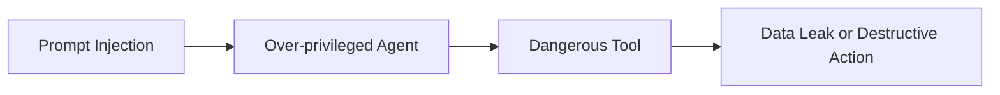

# فصل ۹: Anti-patternها در MLSecOps

## چرا Anti-pattern مهم است؟

بسیاری از شکست‌های امنیتی در سامانه‌های هوش مصنوعی از نبود ابزار پیشرفته نیست؛ از تصمیم‌های معماری غلط، اعتماد بیش از حد به مدل، حذف کنترل‌های ساده و نبود شواهد قابل بررسی ناشی می‌شود. این فصل رایج‌ترین الگوهای غلط را جمع‌بندی می‌کند.

## Anti-patternهای رایج

| Anti-pattern | پیامد | جایگزین درست |
|---|---|---|
| اجرای مدل بدون `Gateway` | نبود کنترل ورودی، خروجی و telemetry | استفاده از `AI Gateway` |
| اعتماد کامل به خروجی مدل | اجرای تصمیم اشتباه یا ناامن | اعتبارسنجی خروجی و review انسانی |
| استفاده از داده واقعی در آزمایش | نشت داده و نقض حریم خصوصی | داده ماسک‌شده یا synthetic کنترل‌شده |
| مدل بدون امضا | امکان جایگزینی یا tampering | `Model Signing` و attestation |
| RAG بدون ACL | افشای اسناد داخلی | authorization در زمان retrieval |
| Agent با ابزارهای زیاد | سوءاستفاده از ابزار و افزایش دسترسی | `Scoped Tool Access` |
| نبود Evidence Pack | عدم امکان ممیزی یا تحلیل رخداد | ثبت خودکار شواهد |
| اشتراک `Vector DB` بین چند tenant | نشت اطلاعات بین مشتریان | index فیزیکی جدا یا isolation سخت‌گیرانه |
| اتصال مستقیم Agent به `Production DB` | دستکاری یا export غیرمجاز داده | ابزار محدود، read-only view و `Intent Gate` |
| `Auto-Retrain` بدون gate امنیتی | انتشار مدل آلوده یا degraded به production | اجرای کامل مراحل و gateهای CT |
| اجرای ابزارها بدون `Sandbox` | `RCE` یا سوءاستفاده از APIها | container جدا، egress محدود و allowlist |
| استفاده از `Pickle` بدون اسکن | deserialization attack و اجرای کد مخرب | `ModelScan` و ممنوعیت فرمت ناامن |
| نبود prompt/response logging | عدم امکان تحلیل رخداد | runtime telemetry و retention کنترل‌شده |
| جایگزین کردن ابزار به‌جای کنترل | حس امنیت کاذب | threat model، policy و evidence |

## مدل بدون Provenance

یکی از خطرناک‌ترین وضعیت‌ها این است که تیم نداند مدل دقیقاً با چه داده‌ای، چه کدی، چه وابستگی‌هایی و چه پارامترهایی ساخته شده است. در چنین حالتی، حتی اگر مدل خوب کار کند، از نظر امنیتی قابل دفاع نیست.

نشانه‌ها:

- مدل در رجیستری هست اما منشأ داده مشخص نیست.
- نسخه کد آموزش ثبت نشده است.
- نتایج تست امنیتی وجود ندارد.
- هش و امضای مدل ذخیره نشده است.

## RAG بدون مرز امنیتی

در بعضی معماری‌ها، هر سندی که در سازمان وجود دارد وارد `Vector DB` می‌شود و مدل هنگام پاسخ‌گویی آزادانه از آن استفاده می‌کند. این کار باعث می‌شود سیستم chat به یک مسیر افشای داده تبدیل شود.

کنترل درست:

- `Allowlist` برای منابع ingest
- کنترل دسترسی در زمان query
- جداسازی tenant
- حذف سندهای حساس یا غیرمجاز
- تست `Retrieval Leakage`

## Agent بدون کنترل ابزار

عامل هوشمندی که به ابزارهای زیاد و حساس دسترسی دارد، در صورت `Prompt Injection` یا خطای برنامه‌ریزی می‌تواند از دستیار به مهاجم داخلی تبدیل شود.

## تست امنیتی یک‌باره

مدل و محیط اطراف آن دائماً تغییر می‌کند. اگر تست امنیتی فقط هنگام انتشار اولیه اجرا شود، بازآموزی، تغییر داده، تغییر prompt، تغییر ابزار یا تغییر مدل پایه می‌تواند کنترل‌های قبلی را بی‌اثر کند.

الگوی درست:

- تست امنیتی در هر build
- تست regression برای سناریوهای حمله
- baseline امضاشده
- مانیتورینگ در `Runtime`

## اصل عملی

هر جا سیستم بر اساس اعتماد ضمنی عمل می‌کند، یک `Anti-pattern` محتمل وجود دارد. در `MLSecOps` اعتماد باید با کنترل، شواهد و محدودیت جایگزین شود.

