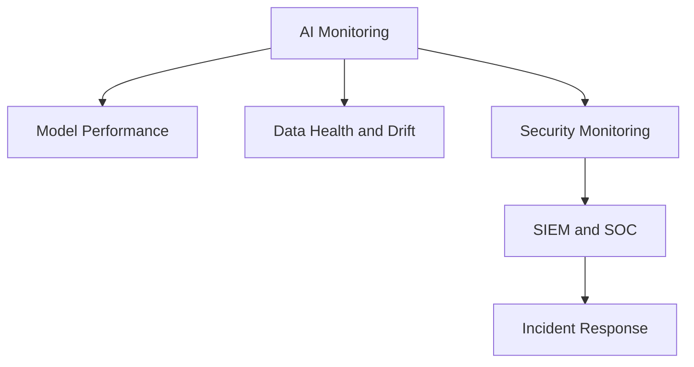
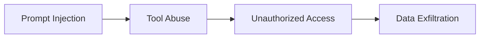

# فصل ۱۰: مانیتورینگ، SOC و پاسخ به رخداد

## مانیتورینگ در سامانه‌های AI

مانیتورینگ هوش مصنوعی فقط بررسی uptime یا latency نیست. باید رفتار مدل، داده، پرامپت، ابزارها، خروجی‌ها، drift و رخدادهای امنیتی نیز پایش شوند.

مانیتورینگ در `MLSecOps` باید سه لایه را هم‌زمان ببیند:

| لایه | شاخص‌های نمونه |
|---|---|
| `Model Performance Monitoring` | `Accuracy`، quality metric، latency، `P95/P99`، throughput، error rate، مصرف CPU/GPU/Memory |
| `Data Health Monitoring` | `Data Drift`، `Concept Drift`، `Schema Deviation`، missing values، تغییر توزیع داده و الگوی کاربران |
| `Security Monitoring` | `Prompt Injection`، `Jailbreak`، `Tool Abuse`، `Model Extraction`، `RAG Poisoning`، `Memory Poisoning`، `Context Poisoning` و رفتار غیرعادی کاربران یا Agentها |

## داده‌های مورد نیاز برای Telemetry

| داده | دلیل اهمیت |
|---|---|
| `Prompt` | تحلیل prompt injection و سوءاستفاده |
| `Response` | بررسی نشت داده و خروجی ناامن |
| `Session ID` | بازسازی مسیر تعامل |
| `Trace ID` | اتصال رخدادها بین سرویس‌ها |
| `Model Version` | تشخیص نسخه آسیب‌دیده |
| `Tool Call` | بررسی سوءاستفاده از ابزار |
| `Retrieval Event` | تحلیل نشت یا poisoning در RAG |
| `Policy Decision` | بررسی دلیل allow یا block |
| `Guardrail Decision` | بررسی اینکه کدام کنترل ورودی یا خروجی allow/block/redact کرده است |
| `User Identity` | تحلیل دسترسی و رفتار کاربر |
| `Access Context` | بازسازی سطح دسترسی کاربر، tenant، نقش و منبع درخواست |
| `Authentication Event` | تحلیل ورود، token و وضعیت احراز هویت |
| `Authorization Event` | بررسی مجوزدهی و تصمیم‌های دسترسی |

## یکپارچه‌سازی با SOC

رخدادهای هوش مصنوعی نباید جدا از دید امنیتی سازمان مدیریت شوند. لاگ‌ها و هشدارهای AI باید وارد `SIEM`، `SOAR`، سامانه مدیریت رخداد و فرآیند threat hunting شوند.

| ابزار یا قابلیت | کاربرد |
|---|---|
| `SIEM` | جمع‌آوری و همبستگی لاگ‌ها |
| `SOAR` | خودکارسازی پاسخ به رخداد |
| `Threat Intelligence` | غنی‌سازی تحلیل حمله |
| `Case Management` | مدیریت پرونده رخداد |
| `Threat Hunting` | کشف الگوهای پنهان حمله |

## Detection Engineering

ثبت لاگ کافی نیست. باید قوانین کشف تهدید برای رفتارهای خاص AI تعریف شود.

نمونه موارد قابل شناسایی:

- افزایش `Prompt Injection`
- تلاش برای `Jailbreak`
- نرخ غیرعادی `Tool Call`
- تلاش برای استخراج مدل
- افزایش دسترسی به اسناد حساس
- الگوهای مشکوک در `Retrieval`
- خروجی‌های حاوی داده حساس
- رفتار غیرعادی عامل‌ها
- `Agent Misbehavior`
- `Excessive Tool Invocation`
- `Suspicious Retrieval Activity`
- افزایش دسترسی یا `Privilege Escalation` توسط agentها

## تحلیل تهدید با MITRE ATLAS

`MITRE ATLAS` می‌تواند زبان مشترک SOC، Blue Team و Red Team برای تحلیل رخدادهای AI باشد. نگاشت کامل‌تر تهدید به شناسه `AML.T...` در فصل ۱۲ و پیوست ب فصل ۱۵ آمده است.

| تهدید | تکنیک ATLAS |
|---|---|
| `Prompt Injection` | `LLM Prompt Injection` |
| `Jailbreak` | `LLM Safety Bypass` |
| `Data Poisoning` | `Poison Training Data` |
| `Model Extraction` | `Exfiltration via Inference API` |
| `RAG Poisoning` | `Poison Retrieval Corpus` |
| `Memory Poisoning` | `Poison Agent Memory` |
| `Tool Abuse` | `Abuse Agent Tooling` |
| `Data Exfiltration` | `Exfiltration of Sensitive Information` |

## نمونه سناریوهای SIEM

| سناریو | جریان تشخیص | شاخص‌های قابل پایش |
|---|---|---|
| تلاش برای `Prompt Injection` | کاربر prompt مشکوک می‌فرستد، gateway آن را block می‌کند، SIEM تعداد blockها را برای هر user/session می‌شمارد. | تعداد promptهای block شده، jailbreak attempt، نرخ block به کل درخواست‌ها |
| سوءاستفاده از ابزار | عامل ابزارهای متعدد یا حساس را با حجم غیرعادی فراخوانی می‌کند و SIEM تنوع و حجم استفاده را تحلیل می‌کند. | تعداد tool call، تعداد ابزارهای استفاده‌شده، نرخ خطا، دسترسی به ابزار حساس |

آستانه‌ها باید بر اساس baseline واقعی محیط staging یا production تنظیم شوند. مقدار ثابت بدون baseline می‌تواند هم false positive زیاد بسازد و هم حمله واقعی را پنهان کند.

## زنجیره حمله نمونه

## پاسخ به رخداد

پاسخ به رخداد در AI باید علاوه بر سرویس و زیرساخت، مدل و داده را نیز پوشش دهد. ممکن است لازم باشد مدل rollback شود، index پاک‌سازی شود، حافظه عامل حذف شود یا داده آموزشی بررسی گردد.

| سناریو | اقدام اولیه |
|---|---|
| نشت داده از خروجی مدل | توقف مسیر خروجی، بررسی لاگ، فعال‌سازی DLP |
| آلودگی RAG | حذف سند آلوده، re-index، بررسی دسترسی‌ها |
| سوءاستفاده از ابزار Agent | غیرفعال‌سازی ابزار، بررسی trace، نیاز به تأیید انسانی |
| مدل آلوده یا backdoor | rollback به مدل امضاشده قبلی |
| drift خصمانه | توقف بازآموزی خودکار و بررسی دستی داده |

## مدیریت False Positive

در سامانه‌های AI، رفتار کاربران و Agentها متنوع است و ruleهای ساده می‌توانند هشدار کاذب زیادی تولید کنند. مدیریت false positive باید بخشی دائمی از عملیات SOC باشد.

| کنترل | هدف |
|---|---|
| baseline دوره‌ای | جمع‌آوری ۲ تا ۴ هفته ترافیک عادی برای تعیین آستانه واقعی |
| `Context-Aware Severity` | تعیین شدت هشدار بر اساس رفتار کامل session، نه یک رویداد منفرد |
| feedback loop | استفاده از بازخورد تحلیلگران SOC برای اصلاح ruleها |
| use-case segmentation | rule جدا برای کاربر داخلی، API عمومی و Agent |
| temporary suppression | کاهش هشدار غیرضروری هنگام deploy یا maintenance کنترل‌شده |

چرخه بهبود ruleها باید شامل تولید هشدار، بررسی SOC، برچسب‌گذاری true/false positive، اصلاح rule، انتشار نسخه جدید و پایش مجدد باشد.

## SLA پاسخ به رخداد

| سطح | نمونه رخداد | Acknowledge | Containment | Postmortem |
|---|---|---|---|---|
| `P1 Critical` | نشت فعال داده، اجرای tool مخرب یا سوءاستفاده موفق از Agent | ۱۵ دقیقه | ۱ ساعت | اجباری، حداکثر ۵ روز کاری |
| `P2 High` | تلاش مکرر bypass، jailbreak یا adversarial drift مشکوک | ۱ ساعت | ۴ ساعت | توصیه‌شده |
| `P3 Medium` | spike در block rate یا anomaly بدون شواهد نشت | ۴ ساعت | ۱ روز کاری | در صورت تکرار |
| `P4 Low` | single block یا تست داخلی | ۱ روز کاری | نیاز ندارد | اختیاری |

شدت رخداد باید بر اساس اثر واقعی بر محرمانگی، یکپارچگی و دسترس‌پذیری تعیین شود، نه صرفاً تعداد alertها.

## شواهد موردنیاز برای تحلیل رخداد

| Artifact | هدف |
|---|---|
| `Prompt Trace` | بازسازی تعامل مهاجم |
| `Response Trace` | تحلیل پاسخ مدل |
| `Model Version Snapshot` | تعیین نسخه دقیق مدل |
| `Conversation Evidence` | تحلیل کامل نشست |
| `Tool Invocation Logs` | بررسی اقدامات Agent و زنجیره multi-agent |
| `Session ID / Trace ID` | اتصال رخدادها |
| `Evidence Pack` | نگهداری tamper-evident شواهد |

## اقدامات ۳۰ دقیقه اول رخداد

1. `Snapshot`: ثبت prompt، response، tool call، model version، session id و trace id.
2. `Containment`: غیرفعال‌سازی tool پرریسک، agent مشکوک یا endpoint آسیب‌دیده.
3. `Verify`: بررسی امضای مدل، صحت artifact و آخرین deploy یا CT.
4. `Rollback`: بازگشت به آخرین نسخه امضاشده و تأییدشده.
5. `Timeline`: ثبت زمان و اقدام‌ها برای postmortem.

بدون snapshot اولیه، تحلیل بسیاری از رخدادهای AI عملاً ناموفق خواهد بود.

## عملیات روزمره Day-2

| عملیات | هدف |
|---|---|
| `Secret Rotation` | کاهش ریسک افشای credential |
| `Agent Permission Review` | حذف دسترسی‌های قدیمی یا غیرضروری |
| `Embedding Cleanup` | کاهش leakage در RAG |
| `Prompt Template Review` | جلوگیری از drift و bypass |
| `Prompt Trace Retention Review` | کنترل حریم خصوصی و حجم لاگ |
| `Model Retirement` | حذف مدل و artifact منسوخ |
| `SIEM Rule Tuning` | کاهش false positive |

بسیاری از رخدادها از فراموشی پس از deploy ایجاد می‌شوند، نه فقط از ضعف مدل.

## شاخص‌های امنیتی

| شاخص | کاربرد |
|---|---|
| نرخ prompt injection | سنجش تلاش‌های حمله |
| نرخ block در guardrail | سلامت کنترل‌های زمان اجرا |
| تعداد tool call حساس | کشف سوءاستفاده |
| نرخ retrieval از اسناد حساس | تشخیص نشت احتمالی |
| drift score | تشخیص تغییر رفتار داده |
| rollback count | سنجش پایداری انتشار مدل |

## اولویت‌بندی کنترل‌های SOC

| سطح | کنترل |
|---|---|
| `MUST` | runtime telemetry، prompt logging، tool logging، model version tracking و runbook رخداد |
| `SHOULD` | detection rule، correlation rule، SLA و threat hunting |
| `ADVANCED` | نگاشت کامل `MITRE ATLAS`، automation با `SOAR`، behavioral analytics و automated response |

## اگر فقط سه کنترل SOC/Runtime اجرا شود

1. ارسال telemetry یکپارچه شامل prompt، tool call، model version و trace id به SIEM.
2. حداقل یک detection rule برای prompt injection و tool abuse همراه با فرآیند false positive.
3. runbook رخداد شامل snapshot، containment و rollback.

## اصل عملی

اگر رفتار AI در `Runtime` دیده نشود، امنیت آن قابل مدیریت نیست. مانیتورینگ باید از روز اول بخشی از طراحی باشد، نه افزونه‌ای بعد از استقرار.

## جمع‌بندی عملی

- `Pipeline Security` به‌تنهایی کافی نیست و runtime باید به‌صورت مستمر پایش شود.
- `Runtime Telemetry` پایه اصلی عملیات امنیتی AI است.
- detection ruleها باید بر اساس baseline واقعی تنظیم شوند.
- مدیریت false positive بخشی دائمی از عملیات SOC است.
- `Day-2 Operations` به اندازه deploy اهمیت دارد.
- موفقیت پاسخ به رخدادهای AI تا حد زیادی به کیفیت snapshot اولیه وابسته است.

