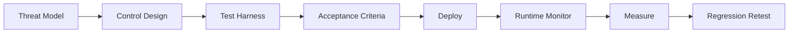

# فصل ۱۱: حاکمیت، انطباق و Evidence Pack

<div dir="rtl">

## حاکمیت در MLSecOps

حاکمیت یعنی تصمیم‌های مربوط به مدل، داده، ریسک و انتشار قابل توضیح، قابل پیگیری و قابل ممیزی باشند. در سامانه‌های هوش مصنوعی، نبود حاکمیت باعث می‌شود تیم‌ها نتوانند توضیح دهند مدل چگونه ساخته شده، چرا منتشر شده و در رخداد امنیتی باید چه چیزی بررسی شود.

## نگاشت OpenSSF MLSecOps (Whitepaper ۲۰۲۵)

`OpenSSF` در whitepaper «Visualizing Secure MLOps» ۲۲ کنترل امنیتی را در سه حوزه `Data`، `Model` و `DevOps` نگاشت کرده است. این سند مرجع معماری برای personaهای data scientist، ML engineer و security team است. نگاشت خلاصه:

| حوزه | نمونه کنترل |
|---|---|
| Data | validation، anonymization، access control، lineage |
| Model | artifact scan، adversarial test، signing، registry hardening |
| DevOps | secret management، IaC scan، CI/CD attestation، runtime monitoring |

Evidence Pack سازمان باید نشان دهد کدام یک از این ۲۲ کنترل — متناسب با threat model — پیاده شده‌اند.

## AI Design Assurance Level (AI-DAL)

برای سامانه‌های پرریسک (پزشکی، مالی، زیرساخت حیاتی)، چارچوب `AI-DAL` (مبتنی بر ایده‌های `DAL` در مهندسی نرم‌افزار safety-critical) سطح assurance طراحی را بر اساس اثر adverse impact تعیین می‌کند. هر سطح AI-DAL مجموعه‌ای از الزامات طراحی، تست و artifact انطباق دارد. این رویکرد مکمل `ISO/IEC 42001` و `EU AI Act` برای high-risk AI systems است.

## FMEA-AI و STRIDE-AI

برای threat modeling ساختاریافته:

| روش | کاربرد |
|---|---|
| `STRIDE-AI` | نگاشت تهدید به دارایی‌های ML (داده، مدل، API) |
| `FMEA-AI` | ارزیابی اثر fairness و harm الگوریتمی با Failure Mode and Effects Analysis |
| `Color Teams` | ترکیب red/blue/purple team برای چرخه توسعه ML |

## چارچوب‌های مرجع

| چارچوب | کاربرد |
|---|---|
| `NIST AI RMF` | مدیریت ریسک سامانه‌های هوش مصنوعی |
| `ISO/IEC 42001` | سیستم مدیریت هوش مصنوعی |
| `ISO/IEC 23894` | مدیریت ریسک AI |
| `OWASP LLM Top 10` | تهدیدهای مدل‌های زبانی (نسخه ۲۰۲۵، تثبیت‌شده) |
| `OWASP ML Top 10` | تهدیدهای مدل‌های ML (همچنان `draft`) |
| `OWASP LLMSVS` | استاندارد verification برای LLM (تست و ارزیابی ساختاریافته) |
| `MITRE ATLAS` | مدل‌سازی تکنیک‌های حمله به AI |
| `EU AI Act` | الزامات قانونی مبتنی بر سطح ریسک |

## Evidence Pack چیست؟

`Evidence Pack` بسته‌ای از شواهد فنی و مدیریتی است که نشان می‌دهد مدل چگونه ساخته، ارزیابی، کنترل و منتشر شده است. این بسته باید به‌صورت خودکار در پایپ‌لاین تولید شود.

## محتوای پیشنهادی Evidence Pack

| بخش | شواهد |
|---|---|
| داده | منشأ داده، نسخه، مالک، سطح حساسیت، نتایج اسکن |
| مدل | نسخه، پارامترها، متریک‌ها، هش، امضا |
| امنیت | نتایج تست adversarial، backdoor، prompt injection |
| زنجیره تأمین | `SBOM`، `AI-BOM`، آسیب‌پذیری‌ها، provenance |
| سیاست | تصمیم gateها، policyها، approvalها |
| استقرار | نسخه محیط، تنظیمات، روش انتشار، rollback plan |
| Runtime | telemetry، alertها، تصمیم‌های guardrail |

## اجزای Evidence Pack

| مؤلفه | محتوا | کاربرد |
|---|---|---|
| هویت مدل | hash، نسخه، منبع و تاریخ build | ردیابی در رخداد و rollback |
| زنجیره تأمین | `SBOM/AI-BOM`، `SLSA`، `in-toto` و provenance | ممیزی supply chain |
| یکپارچگی | امضای دیجیتال با `Cosign/Sigstore` و نتیجه verify | جلوگیری از جایگزینی artifact |
| تست امنیتی | گزارش `ModelScan`، `ART`، prompt injection و poisoning | اثبات due diligence |
| policy | لاگ quality gate، `OPA/Conftest`، استثناها و تأییدکننده | شفافیت تصمیم `Go/No-Go` |
| runtime | telemetry، alert و prompt trace در رخداد | پاسخ به incident و postmortem |

## ارتباط با Compliance

| چارچوب | ارتباط با Evidence Pack |
|---|---|
| `NIST AI RMF / ISO 42001` | Evidence Pack خروجی عملیاتی بخش‌های govern و map است و نشان می‌دهد کنترل‌ها واقعاً پیاده شده‌اند. |
| `EU AI Act` | برای سیستم‌های پرریسک، مستندسازی داده، نظارت پس از استقرار و ثبت رخداد از evidence و SOC telemetry تغذیه می‌شود. |
| `ISO/IEC 23894` | ریسک‌های risk register باید به نگاشت تهدید، چک‌لیست production و کنترل‌های قابل ممیزی trace شوند. |

### نگاشت عملی الزامات EU AI Act (سیستم‌های High-Risk) به کنترل‌ها

| الزام EU AI Act | کنترل معادل در این مقاله |
|---|---|
| `Risk Management System` (Art. 9) | مدیریت ریسک + threat model نسخه‌دار (فصل ۲) |
| `Data Governance` (Art. 10) | کنترل داده، lineage، PII masking (فصل ۴) |
| `Technical Documentation` (Art. 11) | `Evidence Pack` و `AI-BOM` (فصل ۵، ۱۱) |
| `Record-Keeping / Logging` (Art. 12) | telemetry، prompt/tool logging (فصل ۱۰) |
| `Transparency` (Art. 13) | مستندسازی مدل، provenance، watermark |
| `Human Oversight` (Art. 14) | `HITL` و `Intent Gate` (فصل ۸) |
| `Accuracy, Robustness, Cybersecurity` (Art. 15) | تست adversarial، signing، runtime guardrail (فصل ۵، ۶، ۷) |
| `Post-Market Monitoring` (Art. 72) | مانیتورینگ runtime و SOC (فصل ۱۰) |

این نگاشت نشان می‌دهد کنترل‌های فنی MLSecOps می‌توانند مستقیماً شواهد انطباق با `EU AI Act` تولید کنند؛ به‌شرط آنکه evidence به‌صورت خودکار و قابل ممیزی نگهداری شود.

### نگاشت الزامات EU AI Act به مؤلفه‌های Evidence Pack

جدول زیر نشان می‌دهد برای سیستم‌های high-risk، هر الزام قانونی باید در کدام بخش `Evidence Pack` (فصل ۱۱) و با چه شواهدی پوشش داده شود:

| الزام EU AI Act | مؤلفه Evidence Pack | شواهد مورد انتظار |
|---|---|---|
| `Risk Management System` (Art. 9) | policy + threat model | سند threat model نسخه‌دار، risk register، تصمیم gateها |
| `Data Governance` (Art. 10) | داده | lineage، data contract، گزارش PII scan، نسخه dataset |
| `Technical Documentation` (Art. 11) | bundle کامل | Evidence Pack امضاشده برای هر deploy |
| `Record-Keeping / Logging` (Art. 12) | runtime + policy | لاگ prompt/tool/retrieval، retention policy، gate audit log |
| `Transparency` (Art. 13) | هویت مدل + زنجیره تأمین | provenance، `AI-BOM`، مستندات مدل و watermark (در صورت وجود) |
| `Human Oversight` (Art. 14) | policy + runtime | لاگ `HITL`، runbook تأیید انسانی، kill switch |
| `Accuracy, Robustness, Cybersecurity` (Art. 15) | تست امنیتی + یکپارچگی | گزارش `ART`/red team، `ASR` نسبت به baseline، امضا و verify |
| `Post-Market Monitoring` (Art. 72) | runtime | telemetry، alertهای SOC، drift report، postmortem |

> این نگاشت راهنمای فنی است، نه مشاوره حقوقی. تفسیر نهایی الزامات `EU AI Act` بر عهده تیم حقوقی و compliance سازمان است.

## Policy-as-Code

سیاست‌های امنیتی نباید فقط در سند باقی بمانند. باید به شکل قابل اجرا در پایپ‌لاین و runtime اعمال شوند. ابزارهایی مانند `OPA`، `Conftest` یا policy engine داخلی می‌توانند این کار را انجام دهند.

نمونه سیاست‌ها:

- مدل بدون امضا اجازه انتشار ندارد.
- داده دارای `PII` ماسک‌نشده اجازه آموزش ندارد.
- آسیب‌پذیری بحرانی در وابستگی‌ها باعث توقف build می‌شود.
- مدل `LLM` بدون تست prompt injection اجازه deploy ندارد.
- عامل بدون `Intent Gate` اجازه فراخوانی ابزار حساس ندارد.

## مسئولیت‌ها

| نقش | مسئولیت |
|---|---|
| مالک مدل | تعریف هدف، معیار پذیرش و ریسک کسب‌وکاری |
| تیم ML | آموزش، ارزیابی و ثبت نسخه |
| تیم امنیت | threat model، تست امنیتی و سیاست‌ها |
| تیم پلتفرم | زیرساخت، دسترسی، مانیتورینگ و استقرار |
| تیم حاکمیت | انطباق، audit و مدیریت شواهد |

## Persona و مسئولیت مشترک

| Persona | تمرکز امنیتی | حوزه مسئولیت |
|---|---|---|
| `Solution / ML Architect` | معماری امن و مرز سرویس | مقدمه، پایپ‌لاین و تطبیق MLOps |
| `MLOps / AI Engineer` | pipeline، deploy و CT | پایپ‌لاین و ابزارها |
| `Data Scientist / Engineer` | کیفیت داده و experimentation | داده و آزمایش |
| `Data Governance` | `PII`، انطباق و lineage | داده و compliance |
| `Product Security` | threat model، gate و assurance | تهدیدها و پایپ‌لاین |
| `SOC / IR` | runtime، alert و evidence رخداد | SOC و evidence pack |

## ذخیره Tamper-Evident

حداقل عملی برای نگهداری شواهد:

1. `Evidence Pack` در `S3` یا معادل آن با `Object Lock` ذخیره شود.
2. هر bundle با `Cosign` امضا شود و پیش از deploy verify گردد.
3. دسترسی write از read جدا باشد و ممیزی فقط read-only انجام شود.
4. در رخداد `P1`، snapshot فوری در bucket جدا با lock ذخیره شود.

گزینه پیشرفته برای سازمان‌های دارای الزام ممیزی سخت، استفاده از `Rekor Transparency Log` یا hash chain در manifest است.

## Security Validation و Assurance

کنترل بدون سنجش اثربخشی فقط یک checkbox است. حلقه assurance باید نشان دهد gateها واقعاً مؤثرند و تصمیم deploy بر اساس معیار عددی گرفته می‌شود.



| مرحله | خروجی | مالک |
|---|---|---|
| `Test Harness` | suite نسخه‌دار در Git | Security + MLOps |
| Gate ۷ | گزارش متریک و hash suite | MLOps |
| تصمیم deploy | pass/fail نسبت به baseline | Model Owner |
| Production | telemetry و feedback مربوط به FP/FN | SOC |
| CT / retrain | regression کامل suite | MLOps |

## متریک‌های Assurance

| کنترل | متریک | Acceptance نمونه | تناوب |
|---|---|---|---|
| `Policy Gate / OPA` | نرخ شناسایی violation در red team | ۱۰۰٪ روی ruleهای critical | هر release |
| `LLM Gateway` | false negative روی injection suite | حداکثر ۵٪ critical prompts | ماهانه و پس از tune |
| `LLM Gateway` | false positive روی benign suite | حداکثر ۲٪ | ماهانه |
| `ART` | `ASR @ epsilon` | حداکثر baseline + ۲٪ | هر مدل جدید |
| `RAG Ingest` | poison doc retrieval rate | صفر درصد در regression set | هر index change |
| `Agent Output Gate` | bypass در output-injection cases | صفر critical | هر agent release |

## Regression Security Score

برای تصمیم‌گیری می‌توان یک امتیاز مفهومی تعریف کرد:

```text
score = w1 * clean_metric + w2 * (1 - ASR_or_bypass_rate) + w3 * gate_pass_rate
```

deploy فقط زمانی مجاز است که:

```text
score(new) >= score(baseline_signed) - delta
```

مقدار `delta` باید در threat model سازمان تعیین شود؛ مثلاً `0.02`.

## Governance Benchmark Suite

برای اینکه assurance قابل تکرار باشد، benchmark امنیتی باید نسخه‌دار و قابل ردیابی باشد:

1. test suite در repository با tag مانند `security-suite-v1.x` نگهداری شود.
2. هر تغییر در gate یا guardrail باعث اجرای دوباره suite در CI شود.
3. نتایج در `Evidence Pack` همراه hash suite، تاریخ اجرا و نسخه مدل ثبت شود.
4. false negative، یعنی حمله‌ای که باید block می‌شد اما عبور کرده، به‌عنوان incident یا defect با severity بالاتر از false positive پیگیری شود.

## Verification در برابر Validation

| محور | `Verification` | `Validation` |
|---|---|---|
| سؤال | آیا کنترل درست پیاده شده است؟ | آیا مدل یا سیستم برای production کافی است؟ |
| مثال | OPA rule deploy شده و gateway در مسیر traffic است | `ASR`، bypass rate و accuracy قابل قبول‌اند |
| محل | audit زیرساخت و checklist production | Gate ۷ و Canary |

سطح بلوغ ۲ یعنی gate و suite ثابت وجود دارد. سطح بلوغ ۳ یعنی regression score خودکار و tracking خطاهای false negative در SOC برقرار است.

## افشای آسیب‌پذیری و منابع اطلاعاتی بیرونی

حاکمیت `MLSecOps` نباید فقط درون‌سازمانی باشد. سازمان باید مسیر دریافت و انتشار آسیب‌پذیری‌های مدل/زیرساخت AI را مشخص کند:

| منبع / مکانیزم | کاربرد |
|---|---|
| `huntr` (huntr.com) | پلتفرم bug bounty اختصاصی AI/ML برای دریافت گزارش آسیب‌پذیری |
| `AI Vulnerability Database (AVID)` | پایگاه آسیب‌پذیری‌های شناخته‌شده مدل‌ها |
| `AI Incident Database` | درس‌آموخته از رخدادهای واقعی AI |
| `MITRE ATLAS` | به‌روزرسانی تاکتیک/تکنیک‌های مهاجم |
| `Coordinated Vulnerability Disclosure` داخلی | مسیر رسمی گزارش آسیب‌پذیری مدل‌های سازمان |

توصیه: یک `security.txt` یا فرایند CVD برای مدل‌ها و APIهای AI سازمان تعریف کنید و این منابع را به‌صورت دوره‌ای در threat model (فصل ۲) و suite تست (فصل ۶) بازخورد دهید.

## اصل عملی

اگر مدلی قابل ممیزی نیست، از نظر سازمانی قابل اعتماد نیست. شواهد باید هم‌زمان با ساخت و انتشار مدل تولید شوند، نه بعد از رخداد و به‌صورت دستی.

</div>
