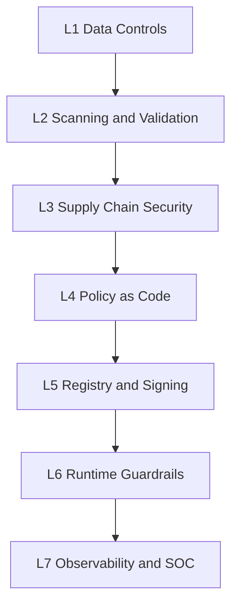

# فصل ۱۲: نگاشت تهدید، کنترل و ابزار

<div dir="rtl">

## هدف نگاشت

نگاشت تهدید، کنترل و ابزار کمک می‌کند تیم‌ها بدانند برای هر ریسک کدام کنترل لازم است و چه ابزارهایی می‌توانند آن کنترل را اجرا یا پشتیبانی کنند. ابزار جایگزین معماری امن نیست، اما اجرای کنترل‌ها را قابل تکرار و قابل ممیزی می‌کند.

## نگاشت اصلی

| تهدید | کنترل | ابزار یا نمونه قابلیت |
|---|---|---|
| `Data Poisoning` | اعتبارسنجی داده، lineage، anomaly detection | `Great Expectations`، `Evidently` |
| نشت `PII` | شناسایی و ماسک‌سازی داده حساس | `Presidio`، `DLP` سازمانی |
| مدل آلوده | اسکن artifact و backdoor test | `ModelScan`، تست داخلی |
| وابستگی آسیب‌پذیر | `SCA` و اسکن کانتینر | `Trivy`، `Syft`، `Grype` |
| secret در کد یا notebook | secret scanning | `Gitleaks`، `TruffleHog` |
| `Prompt Injection` | gateway، تست red team، guardrail | `Promptfoo`، `Garak`، gateway داخلی |
| `RAG Poisoning` | کنترل ingest و retrieval ACL | pipeline داخلی، policy engine |
| `Tool Abuse` | intent gate و scoped access | policy engine، IAM |
| `Memory Poisoning` | sanitization، TTL و provenance | memory gateway داخلی |
| نشت runtime | telemetry و DLP خروجی | `SIEM`، `DLP`، `AI Gateway` |
| `Gradient Leakage` (federated) | secure aggregation، DP | `TensorFlow Privacy`، `OpenDP` |
| حمله به ML امنیتی (IDS/malware) | adversarial robustness در مدل detection | `ART`، retraining |
| multimodal injection | OCR/audio moderation | gateway چندوجهی |
| API key برای LLM | proxy gateway، kill switch | `BlackVault`، `Vault` |

## لایه‌های ابزار



## ابزارها بر اساس مرحله پایپ‌لاین

| مرحله | کنترل | ابزار نمونه |
|---|---|---|
| ورود داده | schema، PII، quality | `Great Expectations`، `Presidio` |
| کد و notebook | secret و dependency scan | `Gitleaks`، `Trivy`، `NB Defense` |
| مدل | artifact scan، adversarial test | `ModelScan`، `ART` |
| زنجیره تأمین | `SBOM` و signing | `Syft`، `CycloneDX`، `Cosign` |
| gateها | policy-as-code | `OPA`، `Conftest` |
| runtime | guardrail و gateway | `NeMo Guardrails`، `Llama Guard`، gateway داخلی |
| SOC | telemetry و detection | `ELK`، `Grafana`، `SIEM` |

## معماری لایه‌ای ابزارها

| لایه | نقش | مرحله پایپ‌لاین | نمونه ابزار |
|---|---|---|---|
| `L1 — داده و آزمایش` | lineage، versioning و reproducibility | ۲، ۵ | `MLflow`، `DVC`، `Great Expectations` |
| `L2 — اسکن و تست امنیتی` | `SAST/SCA`، اسکن artifact، IaC، تست adversarial و LLM | ۳، ۷ | `Gitleaks`، `Trivy`، `Checkov`، `tfsec`، `SonarQube`، `lintML`، `ModelScan`، `ART`، `Garak`، `PyRIT`، `Promptfoo`، `Agentic Security`، `PurpleLlama`، `Mindgard`، `AI-exploits`، `AI-Infra-Guard` |
| `L3 — زنجیره تأمین AI` | `SBOM/AI-BOM`، signing و provenance | ۲، ۹ | `Syft`، `CycloneDX`، `Cosign`، `Sigstore`، `SLSA` |
| `L4 — Policy-as-Code` | quality gate و انطباق dataset | ۴، ۸ | `OPA`، `Conftest`، `Kyverno` |
| `L5 — Registry و استقرار` | ذخیره مدل امضاشده، secret و key | ۹، ۱۰ | `Model Registry`، `S3/Nexus`، `Vault/KMS` |
| `L6 — Runtime و Guardrails` | prompt filtering، moderation و AI gateway | Production | gateway داخلی، `NeMo Guardrails`، `Llama Guard`، `Lakera Guard`، `Patronus` |
| `L7 — Observability و SOC` | drift، alert و SIEM | ۱۰ | `ELK`، `Grafana`، `Evidently`، `WhyLabs`، `HiddenLayer`، `Protect AI AIRS` |

## راهنمای عملی ابزارها برای ساخت Security Pipeline

> دستورها و پارامترهای ارائه‌شده در این بخش صرفاً نمونه‌های رایج در زمان نگارش هستند. نسخه ابزارها، پارامترها و رفتار `exit code` آن‌ها ممکن است تغییر کند؛ بنابراین همیشه به مستندات رسمی ابزار مراجعه شود و خروجی هر ابزار در محیط واقعی validate گردد.

این بخش، مرجع عملی ساخت یک pipeline امنیتی `MLSecOps` است. برای هر ابزار: هدف، نصب، دستور پایه، رفتار در `Gate` (یعنی چه زمانی باید `build` را fail کند) و خروجی قابل ثبت در `Evidence Pack` آمده است. اصل کلیدی این است که هر ابزار باید **exit code** یا خروجی ساختاریافته تولید کند تا pipeline بتواند به‌صورت خودکار تصمیم `Go/No-Go` بگیرد.

### اصل طراحی: هر کنترل باید بتواند pipeline را متوقف کند

```text
scan → parse result → decision (pass/fail) → evidence → (block on fail)
```

ابزاری که فقط گزارش می‌دهد اما pipeline را متوقف نمی‌کند، یک `Anti-pattern` است (فصل ۹). هر مرحله باید یا `exit code != 0` بدهد یا خروجی `JSON` آن توسط یک policy engine ارزیابی شود.

### L2 — اسکن artifact مدل: ModelScan

هدف: شناسایی کد مخرب و عملیات ناامن در فایل مدل (`pickle`, `H5`, `SavedModel`, `PyTorch`) پیش از `load`.

```bash
pip install modelscan
# اسکن یک فایل یا پوشه مدل
modelscan -p ./models/model.pkl
# خروجی JSON برای Evidence Pack
modelscan -p ./models/ -r json -o modelscan-report.json
```

رفتار Gate: `modelscan` این exit codeها را برمی‌گرداند که مستقیماً در pipeline قابل استفاده‌اند:

| Exit Code | معنی | اقدام pipeline |
|---|---|---|
| `0` | پاک، بدون آسیب‌پذیری | ادامه |
| `1` | اسکن موفق، **آسیب‌پذیری یافت شد** | `fail build` |
| `2` | خطای اسکن | بررسی و توقف |
| `3` | فایل پشتیبانی‌نشده | هشدار |
| `4` | خطای استفاده | اصلاح دستور |

Evidence: فایل `modelscan-report.json`. این کنترل در مرحله ۲ (`Load Artifacts`) اجباری است.

### L2 — Secret Scanning: Gitleaks

هدف: یافتن کلید API، توکن و credential در کد، notebook و تاریخچه git.

```bash
# اسکن مخزن و fail در صورت یافتن secret
gitleaks detect --source . --report-format json --report-path gitleaks-report.json --exit-code 1
```

رفتار Gate: با `--exit-code 1`، یافتن هر secret باعث توقف pipeline می‌شود. Evidence: `gitleaks-report.json`.

### L2 — اسکن وابستگی و کانتینر: Trivy

هدف: `SCA` وابستگی‌ها، اسکن image کانتینر، و IaC misconfiguration.

```bash
# اسکن وابستگی‌های پروژه
trivy fs --scanners vuln,secret,misconfig --severity HIGH,CRITICAL --exit-code 1 .
# اسکن image سرویس inference
trivy image --severity CRITICAL --exit-code 1 myorg/llm-serving:1.4.0
```

رفتار Gate: `--exit-code 1` همراه `--severity CRITICAL` باعث می‌شود فقط آسیب‌پذیری بحرانی build را متوقف کند. Evidence: خروجی `--format json`.

### L2 — اسکن notebook: NB Defense و lintML

هدف: notebookها و کد ML معمولاً secret، خروجی حساس و الگوهای ناامن دارند.

```bash
# NB Defense برای اسکن نوت‌بوک
pip install nbdefense && nbdefense scan ./notebooks/
# lintML: linter امنیتی مخصوص کد ML (از Nvidia)
pipx run lintml ./src/
```

رفتار Gate: یافتن secret یا الگوی پرخطر باید build را fail کند. این کنترل در مرحله ۳ اجرا می‌شود.

### L2 — تست adversarial مدل کلاسیک: ART

هدف: سنجش مقاومت مدل `Tabular/Vision/Speech` در برابر ورودی دستکاری‌شده و محاسبه `ASR`.

```python
from art.estimators.classification import SklearnClassifier
from art.attacks.evasion import FastGradientMethod, ProjectedGradientDescent

classifier = SklearnClassifier(model=model)
attack = ProjectedGradientDescent(estimator=classifier, eps=0.1)
x_adv = attack.generate(x=x_test)
asr = compute_attack_success_rate(model, x_test, x_adv, y_test)
assert asr <= BASELINE_ASR + 0.02, "ASR از آستانه threat model عبور کرد"  # fail Gate ۷
```

رفتار Gate: مقایسه `ASR` با baseline؛ عبور از آستانه = fail در Gate ۷. Evidence: گزارش `ASR @ epsilon` و hash مجموعه تست.

### L2 — تست امنیتی LLM: Garak

هدف: اسکن آسیب‌پذیری `LLM` با ۵۰+ probe (prompt injection, jailbreak, encoding, leakage, toxicity).

```bash
python -m pip install -U garak
# اجرای probeهای مرتبط با OWASP LLM01 روی یک مدل
python -m garak --target_type openai --target_name gpt-4o \
  --probes promptinject,dan,encoding,leakreplay \
  --report_prefix garak-ci
# فیلتر probe بر اساس تگ OWASP
python -m garak --target_type huggingface --target_name my-model --probe_tags owasp:llm01
```

رفتار Gate: `garak` گزارش `JSONL` با نرخ موفقیت هر probe می‌دهد؛ یک اسکریپت باید `bypass rate` را با آستانه threat model مقایسه و در صورت عبور build را fail کند. Evidence: `garak-ci.report.jsonl`.

### L2 — Red Team و ارزیابی LLM/RAG/Agent: Promptfoo

هدف: red team خودکار مبتنی بر چارچوب (`owasp:llm`, `mitre:atlas`, `eu:ai-act`) و ادغام در `CI`.

نمونه `promptfooconfig.yaml`:

```yaml
targets:
  - id: https
    label: prod-assistant
    config:
      url: https://api.internal/llm
      method: POST
      headers: { 'Content-Type': 'application/json' }
      body: { prompt: '{{prompt}}' }
redteam:
  frameworks:
    - owasp:llm
    - mitre:atlas
  plugins:
    - owasp:llm
    - pii
    - rag-poisoning
  strategies:
    - prompt-injection
    - jailbreak
```

```bash
# اجرای red team در CI با ثبت context
npx promptfoo@latest redteam run -c promptfooconfig.yaml -o results.json \
  --tag git.sha="$CI_COMMIT_SHA"
```

رفتار Gate: خروجی `results.json` با acceptance threshold مقایسه می‌شود (مثلاً صفر critical bypass). Evidence: `results.json` + tag commit.

### L2 — Red Team چندمرحله‌ای: Microsoft PyRIT

هدف: اتوماسیون حملات چندturn و jailbreak پیشرفته برای LLM و agent.

```bash
pip install pyrit
# PyRIT معمولاً به‌صورت اسکریپت orchestrator اجرا می‌شود (multi-turn attack)
python redteam/pyrit_orchestrator.py --target prod-assistant --strategy crescendo
```

رفتار Gate: مناسب تست عمیق فصلی یا پیش از release بزرگ، نه هر build. Evidence: گزارش conversation و نتیجه.

### L3 — تولید SBOM: Syft

هدف: فهرست وابستگی‌های نرم‌افزاری برای زنجیره تأمین.

```bash
# نصب
curl -sSfL https://raw.githubusercontent.com/anchore/syft/main/install.sh | sh -s -- -b /usr/local/bin
# SBOM از محیط پروژه و image
syft dir:. -o cyclonedx-json=sbom.cdx.json
syft myorg/llm-serving:1.4.0 -o spdx-json=image-sbom.spdx.json
```

Evidence: `sbom.cdx.json`. این در مرحله ۲ و ۹ تولید می‌شود.

### L3 — تولید AI-BOM (ML-BOM): CycloneDX / cdxgen

هدف: فراتر از SBOM؛ ثبت مدل، dataset، prompt و سرویس‌های AI. استاندارد `CycloneDX 1.7` (مصوب ۲۰۲۵، ECMA-424) از `ML-BOM` پشتیبانی می‌کند.

```bash
# با cdxgen (پروژه OWASP CycloneDX)
# تولید AI-BOM اختصاصی شامل مدل، prompt و MCP
npx @cyclonedx/cdxgen@latest aibom .
# یا حالت کامل با audit حاکمیتی
npx @cyclonedx/cdxgen@latest -r --include-formulation -o aibom.json --bom-audit --bom-audit-categories ai-bom
```

برای مدل‌های HuggingFace، `OWASP AIBOM Generator` متادیتای model card را استخراج می‌کند. Evidence: `aibom.json` (شامل hash هر فایل وزن، نسخه dataset و provenance). برای انطباق، AI-BOM را می‌توان با الزامات `EU AI Act Annex IV` مقایسه کرد (فصل ۱۱).

### L3 — امضای مدل: Sigstore model-signing

هدف: امضای رمزنگاری مدل برای اثبات اصالت و جلوگیری از tampering. این پروژه (`sigstore/model-transparency`، نسخه ۱.۰ در ۲۰۲۵، با همکاری OpenSSF/NVIDIA/HiddenLayer) به‌طور خاص برای مدل‌های ML طراحی شده و امضا را در `Rekor` transparency log ثبت می‌کند.

```bash
pip install model-signing
# امضای keyless با Sigstore (پیش‌فرض)
model_signing sign ./models/model.safetensors --signature model.sig
# تأیید پیش از استقرار
model_signing verify ./models/model.safetensors \
  --signature model.sig \
  --identity "ci@myorg.com" \
  --identity_provider "https://token.actions.githubusercontent.com"
```

رفتار Gate: اگر `verify` شکست بخورد، استقرار باید متوقف شود. Evidence: `model.sig` + سابقه Rekor. برای امضای container و artifact عمومی نیز می‌توان از `Cosign` استفاده کرد.

### L4 — Policy-as-Code: OPA / Conftest

هدف: تبدیل سیاست‌های امنیتی به کد اجرایی در `Quality Gate`ها (مرحله ۴ و ۸).

نمونه policy (`Rego`) برای الزام امضا و نبود آسیب‌پذیری بحرانی:

```rego
package mlsecops.gate

deny[msg] {
  input.modelscan.issues_count > 0
  msg := "مدل دارای artifact ناامن است"
}

deny[msg] {
  not input.model.signed
  msg := "مدل امضا نشده است"
}

deny[msg] {
  input.trivy.critical_count > 0
  msg := "وابستگی با آسیب‌پذیری بحرانی"
}
```

```bash
# ارزیابی خروجی تجمیع‌شده اسکن‌ها در برابر policy
conftest test evidence-bundle.json --policy ./policies/
```

رفتار Gate: هر `deny` باعث fail شدن gate می‌شود. Evidence: لاگ تصمیم `OPA/Conftest`.

### L6 — Runtime Guardrail: NeMo Guardrails

هدف: کنترل ورودی/خروجی LLM در زمان اجرا (jailbreak detection, topic control, output moderation).

```bash
pip install nemoguardrails
```

```yaml
# config/rails.yaml
rails:
  input:
    flows:
      - check jailbreak
      - check sensitive data
  output:
    flows:
      - self check output
      - mask pii
```

رفتار Runtime: این کنترل در production اجرا می‌شود، نه در build؛ اما باید تله‌متری block/allow آن به `SIEM` برود (فصل ۱۰). ابزارهای جایگزین: `Lakera Guard`، `Llama Guard`، gateway داخلی.

### L2 — تست زیرساخت MLOps و عامل‌ها

هدف: علاوه بر مدل و LLM، خودِ زیرساخت `MLOps` و منطق agent نیز باید تست شوند (فصل ۵).

```bash
# AI-exploits (Protect AI): بهره‌برداری‌های شناخته‌شده روی سامانه‌های MLOps مثل MLflow/Ray
git clone https://github.com/protectai/ai-exploits && cd ai-exploits
# AI-Infra-Guard (Tencent): کشف ریسک‌های امنیتی در زیرساخت AI
# Agentic Security: red team مخصوص عامل‌ها و tool misuse
pip install agentic_security
```

رفتار: این تست‌ها معمولاً در محیط staging و به‌صورت فصلی یا پیش از release اجرا می‌شوند، نه هر build. یافته بحرانی باید release را متوقف کند.

### L2 — ممیزی حریم خصوصی مدل

هدف: سنجش ریسک `Membership Inference` و `Model Inversion` پیش از انتشار مدل آموزش‌دیده روی داده حساس (فصل ۴).

```bash
# PrivacyRaven (Trail of Bits): تست black-box نشت حریم خصوصی
pip install privacyraven
# ML Privacy Meter: ارزیابی کمی ریسک نشت
pip install ml-privacy-meter
```

رفتار Gate: اگر نرخ موفقیت membership inference از آستانه threat model بالاتر رود، مدل باید با `DP-SGD` بازآموزی یا hardening شود. Evidence: گزارش ریسک حریم خصوصی.

### جدول جمع‌بندی ابزار، دستور و رفتار Gate

| ابزار | مرحله | دستور کلیدی | معیار توقف build |
|---|---|---|---|
| `ModelScan` | ۲ Load | `modelscan -p model.pkl -r json` | exit code `1` |
| `Gitleaks` | ۳ Scan | `gitleaks detect --exit-code 1` | یافتن هر secret |
| `Trivy` | ۳ Scan | `trivy fs --exit-code 1 --severity CRITICAL` | CVE بحرانی |
| `lintML` / `NB Defense` | ۳ Scan | `lintml ./src` / `nbdefense scan` | الگوی ناامن/secret |
| `ART` | ۷ Test | اسکریپت Python + assert ASR | `ASR > baseline+δ` |
| `Garak` | ۷ Test | `garak --probes promptinject ...` | bypass rate بالا |
| `Promptfoo` | ۷ Test | `promptfoo redteam run` | critical bypass > 0 |
| `Syft` | ۲،۹ | `syft dir:. -o cyclonedx-json` | — (تولید evidence) |
| `cdxgen aibom` | ۲،۹ | `aibom .` | فقدان فیلد اجباری AI-BOM |
| `model-signing` | ۹ Sign | `model_signing sign/verify` | شکست verify |
| `Conftest/OPA` | ۴،۸ Gate | `conftest test evidence.json` | هر `deny` |
| `NeMo Guardrails` | Runtime | config rails | block در production |

## نگاشت OWASP ML Top 10 به مراحل MLOps

این جدول برای مدل‌های کلاسیک و چرخه `MLOps` اهمیت دارد. توجه کنید که `OWASP ML Top 10` هنوز پیش‌نویس است و شناسه‌ها ممکن است تغییر کنند:

| مرحله `MLOps` | تهدیدهای مرتبط |
|---|---|
| `Planning and Design` | همه تهدیدها، چون طراحی ضعیف ریسک را در کل چرخه پخش می‌کند |
| `Data Engineering` | `ML02 Poisoning`، `ML06 Supply Chain`، `ML08 Skewing` |
| `Experimentation` | `ML06`، `ML07 Transfer Learning`، `ML10 Model Poisoning` |
| `Pipeline Dev & Test` | `ML02`، `ML06`، `ML10` |
| `CI / CD` | `ML06 Supply Chain` |
| `Continuous Training` | `ML02`، `ML06`، `ML08`، `ML10` |
| `Model Serving` | `ML01 Input Manipulation`، `ML03 Inversion`، `ML04 Membership`، `ML05 Theft`، `ML09 Output Integrity` |
| `Continuous Monitoring` | `ML01`، `ML02`، `ML08 Skewing`، `ML09` |

## کارت مرجع تهدید، کنترل و ابزار

نسخه تجمیع‌شده و کامل این کارت (همراه ستون `Phase` و جزئیات بیشتر) در **پیوست الف فصل ۱۵** آمده است. برای جلوگیری از تکرار، لطفاً برای مشاهده جدول کامل نگاشت تهدیدها به ابزارها و مراحل چرخه حیات، به آن پیوست مراجعه کنید.

## نگاشت MITRE ATLAS

| تهدید | تکنیک | شناسه |
|---|---|---|
| `Prompt Injection` | `LLM Prompt Injection` | `AML.T0051` |
| `Data Poisoning` | `Poison Training Data` | `AML.T0020` |
| `Model Extraction` | `Exfiltration via Inference API` | `AML.T0044` |
| `Adversarial Evasion` | `Evade ML Model` | `AML.T0015` |
| `Supply Chain` | `Publish Poisoned Models` | `AML.T0058` |
| `RAG Poisoning` | `Poison Web Index` | `AML.T0066` |

## نقشه بازار ابزارهای تجاری

علاوه بر ابزارهای متن‌باز، اکوسیستم تجاری `MLSecOps` در حال رشد است. هدف این جدول معرفی **دسته‌ها** برای تصمیم build-vs-buy است، نه تأیید یا تبلیغ محصول خاص؛ انتخاب باید بر اساس «معیار انتخاب ابزار» در بخش بعد انجام شود:

| دسته | نمونه بازیگران بازار | کاربرد |
|---|---|---|
| پلتفرم جامع امنیت AI | `Protect AI`، `HiddenLayer`، `Robust Intelligence` | اسکن مدل، تشخیص تهدید، ممیزی |
| Guardrail / Runtime LLM | `Lakera`، `Prompt Security`، `CalypsoAI`، `Lasso Security` | فیلتر prompt/خروجی در production |
| حاکمیت و انطباق AI | `Credo AI`، `Cranium` | governance، policy و مستندسازی انطباق |
| Red teaming تخصصی | `Adversa`، `Mindgard` | تست تهاجمی مدل و agent |
| حریم خصوصی و داده synthetic | `Private AI`، `Nightfall`، `Gretel`، `Tonic`، `Skyflow` | ماسک PII، DLP و داده مصنوعی |
| یادگیری فدرال امن | `Mithril Security`، `DynamoFL`، `Devron` | آموزش توزیع‌شده با حفظ حریم خصوصی |

توجه: نام‌بردن از یک محصول به‌معنای توصیه نیست. برای انتخاب، ابتدا تهدید و کنترل را مشخص کنید، سپس گزینه متن‌باز و تجاری را با معیارهای زیر بسنجید.

## معیار انتخاب ابزار

ابزار مناسب باید چند ویژگی داشته باشد:

- با `CI/CD` موجود یکپارچه شود.
- خروجی ساختاریافته برای `Evidence Pack` بدهد.
- امکان fail کردن pipeline را داشته باشد.
- قابل نسخه‌گذاری و audit باشد.
- با سیاست‌های سازمانی هماهنگ شود.
- نیازمند استثناهای دستی دائمی نباشد.

## اصل عملی

ابزار باید کنترل امنیتی را اجراپذیر کند، نه اینکه جایگزین تفکر امنیتی شود. ابتدا تهدید و کنترل را مشخص کنید، سپس ابزار را انتخاب کنید.

</div>
